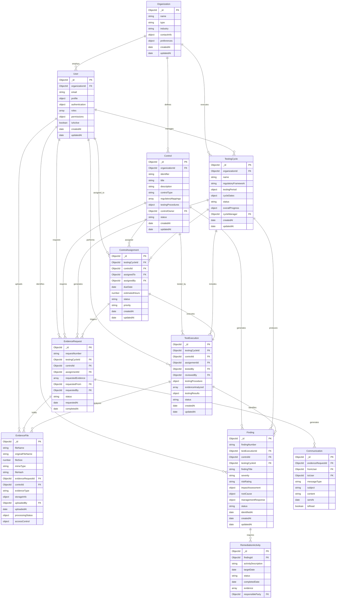
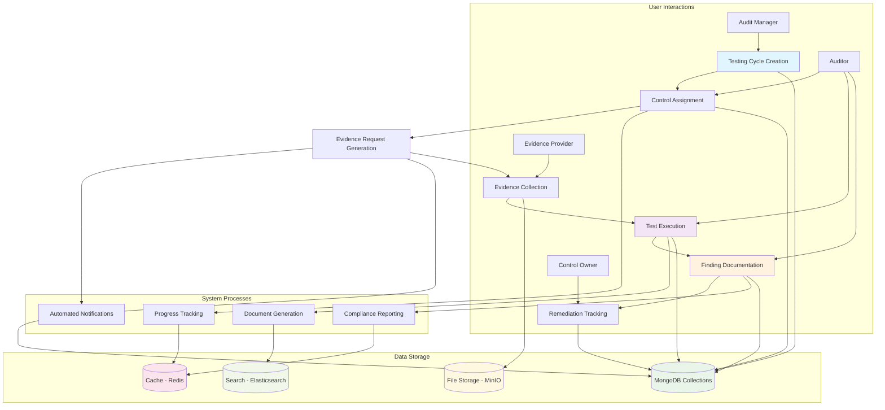
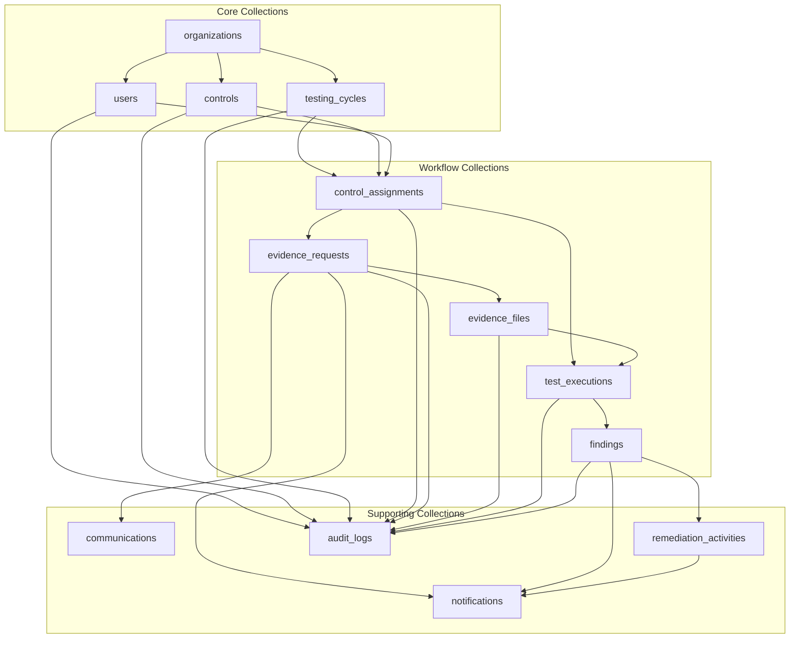
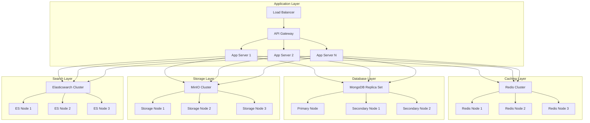
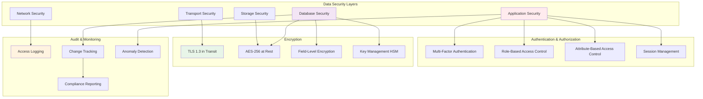
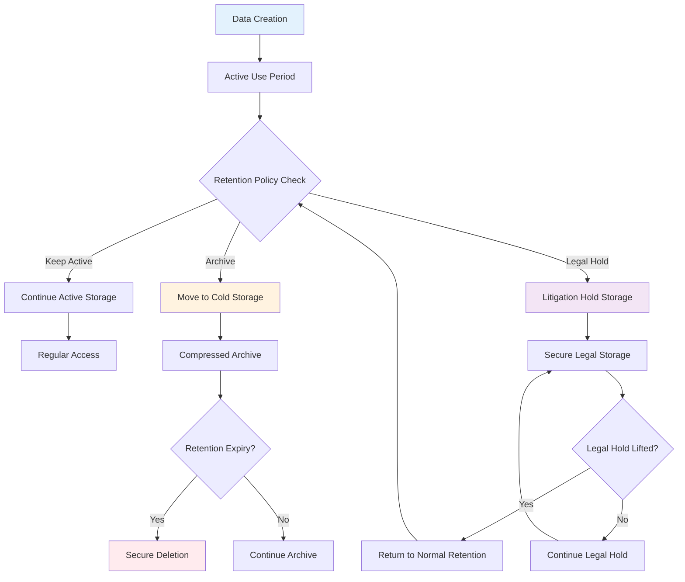
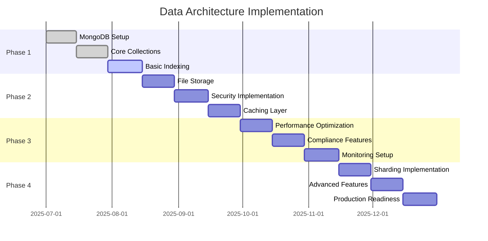

# 🏗️ Data Architecture Document

## GoEdu (omicron) - IT Control Testing Platform

> **Comprehensive data architecture design for a specialized workflow platform that automates IT control testing for financial institutions**

---

## 📄 Document Information

| Field | Value |
|-------|-------|
| **Document Type** | Data Architecture Specification |
| **Version** | 1.0 |
| **Last Updated** | June 29, 2025 |
| **Document Owner** | Technical Team |
| **Review Cycle** | Bi-weekly |
| **Status** | In Review |

---

## 📚 Table of Contents

1. [Architecture Overview](#architecture-overview)
2. [Entity Relationship Design](#entity-relationship-design)
3. [Core Entity Foundation](#core-entity-foundation)
4. [Data Flow Architecture](#-data-flow-architecture)
5. [Performance and Scalability](#performance-and-scalability)
6. [Security and Compliance](#security-and-compliance)
7. [Data Lifecycle Management](#data-lifecycle-management)
8. [API Design Considerations](#api-design-considerations)
9. [Implementation Strategy](#implementation-strategy)

---

## Architecture Overview

Let me guide you through designing a robust data architecture that will serve as the structural foundation for your control testing platform. Think of this process like designing the blueprint for a complex building where every room needs to connect logically, every hallway needs to lead somewhere meaningful, and the overall structure needs to support the activities that will happen inside.

## Understanding Your Data Architecture Challenge

Your requirements document reveals a sophisticated domain where information flows through multiple interconnected workflows. Unlike simple applications where data might flow in straight lines, control testing creates a web of relationships where the same piece of information might be referenced from multiple contexts. An evidence file, for example, might support testing for multiple controls, be referenced in various findings, and need to be accessible through different user interfaces depending on who is viewing it and why.

The key insight here is that your data architecture needs to support not just storage and retrieval, but also the complex audit trails and compliance requirements that banking institutions demand. Every piece of data needs to maintain its lineage, every change needs to be tracked, and every access needs to be logged. This creates architectural requirements that go far beyond typical business applications.

## Core Entity Foundation

Let me start by walking you through the fundamental entities that form the backbone of your system, then show you how they interconnect to support your business workflows.

### User and Organization Structure

Your user management needs to support the complex organizational hierarchies found in banking institutions while maintaining the flexibility to accommodate different organizational structures across your customer base.

```javascript
// User entity structure in MongoDB
{
  _id: ObjectId("..."),
  email: "john.auditor@bank.com",
  profile: {
    firstName: "John",
    lastName: "Smith",
    title: "Senior IT Auditor",
    department: "Internal Audit",
    phoneNumber: "+1-555-0123"
  },
  authentication: {
    passwordHash: "...", // bcrypt hashed
    lastLoginAt: ISODate("2025-06-29T10:30:00Z"),
    mfaEnabled: true,
    mfaSecret: "...", // encrypted
    failedLoginAttempts: 0,
    lockoutUntil: null
  },
  roles: ["auditor"], // Array to support multiple roles
  permissions: {
    canViewControls: true,
    canEditControls: false,
    canAssignTests: false,
    canApproveFindings: false
  },
  organizationId: ObjectId("..."),
  isActive: true,
  createdAt: ISODate("2025-01-15T09:00:00Z"),
  updatedAt: ISODate("2025-06-29T08:15:00Z"),
  createdBy: ObjectId("..."), // Reference to administrator who created account
  metadata: {
    lastPasswordChange: ISODate("2025-04-15T14:20:00Z"),
    timezone: "America/New_York",
    preferences: {
      emailNotifications: true,
      dashboardLayout: "compact"
    }
  }
}
```

Notice how this structure supports both the immediate authentication needs and the longer-term audit trail requirements. The separation between profile information, authentication details, and permissions allows you to modify access controls without affecting user identity information, which is crucial for maintaining data integrity in audit scenarios.

### Regulatory Framework and Control Definitions

Controls represent the heart of your system's domain knowledge. Each control needs to capture not just what should be tested, but how it should be tested and which regulatory requirements it satisfies.

```javascript
// Control entity with embedded regulatory mappings
{
  _id: ObjectId("..."),
  identifier: "ITGC-001", // Human-readable control ID
  title: "Logical Access Controls for Financial Systems",
  description: "Access to financial applications is restricted to authorized personnel based on job responsibilities",
  controlObjective: "Ensure that access to financial data and applications is limited to authorized individuals",
  controlType: "preventive", // preventive, detective, corrective
  automationLevel: "manual", // manual, semi-automated, automated
  
  // Regulatory framework mappings
  regulatoryMappings: [
    {
      framework: "SOX",
      requirement: "Section 404 - Management Assessment of Internal Controls",
      citation: "17 CFR 240.13a-15",
      testingFrequency: "annual"
    },
    {
      framework: "PCI-DSS",
      requirement: "7.1 - Limit access to system components",
      citation: "PCI DSS v4.0 Requirement 7",
      testingFrequency: "quarterly"
    }
  ],
  
  // System scope and applicability
  applicableSystemTypes: ["financial_reporting", "payment_processing"],
  organizationalScope: "enterprise", // enterprise, subsidiary, business_unit
  
  // Control details for testing
  controlActivities: [
    "User access provisioning requires manager approval",
    "Access rights are reviewed quarterly",
    "Terminated employees are promptly removed from systems"
  ],
  
  // Testing procedure template
  testingProcedures: {
    recommendedSampleSize: 25,
    samplingMethod: "random",
    evidenceRequirements: [
      {
        type: "user_access_report",
        description: "Complete listing of user access for selected systems",
        format: "CSV or Excel",
        sourceSystem: "Active Directory"
      },
      {
        type: "hr_verification",
        description: "Employment status verification for sampled users",
        format: "HR system report or attestation",
        sourceSystem: "Human Resources"
      }
    ],
    testingSteps: [
      "Obtain user access report for testing period",
      "Select random sample of users",
      "Verify employment status with HR",
      "Review access permissions against job responsibilities",
      "Document any exceptions identified"
    ]
  },
  
  // Control ownership and management
  controlOwner: ObjectId("..."), // Reference to responsible user
  businessProcess: "financial_reporting",
  riskRating: "high", // high, medium, low
  
  // Version control and history
  version: "2.1",
  status: "active", // active, inactive, retired
  effectiveDate: ISODate("2025-01-01T00:00:00Z"),
  lastReviewDate: ISODate("2025-06-01T00:00:00Z"),
  nextReviewDate: ISODate("2025-12-01T00:00:00Z"),
  
  // Audit trail
  createdAt: ISODate("2024-12-15T10:00:00Z"),
  createdBy: ObjectId("..."),
  updatedAt: ISODate("2025-06-15T14:30:00Z"),
  updatedBy: ObjectId("..."),
  
  // Change history for compliance
  changeHistory: [
    {
      version: "2.0",
      changedAt: ISODate("2025-06-15T14:30:00Z"),
      changedBy: ObjectId("..."),
      changeDescription: "Updated testing procedures based on new PCI DSS requirements",
      fieldsChanged: ["testingProcedures.evidenceRequirements"]
    }
  ]
}
```

This structure demonstrates how you can embed regulatory knowledge directly into your control definitions while maintaining the flexibility to support different regulatory frameworks and organizational requirements. The embedded testing procedures create a direct link between control definition and execution, reducing the coordination overhead that currently plagues manual processes.

## Testing Cycle and Assignment Management

Testing cycles represent the temporal organization of your control testing activities. Each cycle needs to coordinate multiple controls, multiple auditors, and multiple deadlines while maintaining clear accountability and progress tracking.

```javascript
// Testing Cycle entity
{
  _id: ObjectId("..."),
  name: "Q3 2025 SOX Testing Cycle",
  description: "Quarterly SOX 404 compliance testing for financial reporting controls",
  
  // Cycle timing and scope
  regulatoryFramework: "SOX", // Primary framework for this cycle
  testingPeriod: {
    startDate: ISODate("2025-07-01T00:00:00Z"),
    endDate: ISODate("2025-09-30T23:59:59Z")
  },
  cycleDates: {
    planningStartDate: ISODate("2025-06-01T00:00:00Z"),
    testingStartDate: ISODate("2025-07-15T00:00:00Z"),
    testingEndDate: ISODate("2025-09-15T00:00:00Z"),
    reviewEndDate: ISODate("2025-09-30T00:00:00Z")
  },
  
  // Cycle status and progress
  status: "active", // planning, active, review, completed, cancelled
  overallProgress: {
    totalControls: 45,
    assignedControls: 45,
    inProgressControls: 23,
    completedControls: 15,
    overdueControls: 7
  },
  
  // Resource planning
  estimatedHours: 480,
  actualHours: 352, // Updated as work progresses
  
  // Control assignments within this cycle
  controlAssignments: [
    {
      controlId: ObjectId("..."),
      assignedTo: ObjectId("..."), // Auditor user ID
      assignedAt: ISODate("2025-06-15T09:00:00Z"),
      assignedBy: ObjectId("..."), // Manager user ID
      dueDate: ISODate("2025-08-15T17:00:00Z"),
      estimatedHours: 12,
      status: "in_progress", // not_started, in_progress, review, completed
      priority: "high" // high, medium, low
    }
  ],
  
  // Cycle management
  cycleManager: ObjectId("..."),
  reviewers: [ObjectId("..."), ObjectId("...")],
  organizationId: ObjectId("..."),
  
  // Audit trail
  createdAt: ISODate("2025-05-30T10:00:00Z"),
  createdBy: ObjectId("..."),
  updatedAt: ISODate("2025-06-29T16:45:00Z")
}
```

The testing cycle structure creates a natural container for organizing work while maintaining the flexibility to handle different regulatory requirements and organizational preferences. Notice how the embedded assignment structure allows for efficient querying of work assignments while maintaining referential integrity with the control and user collections.

## Evidence Collection and File Management

Evidence management represents one of your application's most complex data challenges because it needs to handle both structured metadata and unstructured file content while maintaining strict security and audit trail requirements.

```javascript
// Evidence Request entity
{
  _id: ObjectId("..."),
  requestNumber: "EVR-2025-Q3-001234", // Human-readable identifier
  
  // Request context
  testingCycleId: ObjectId("..."),
  controlId: ObjectId("..."),
  assignmentId: ObjectId("..."), // Reference to specific control assignment
  
  // Request details
  requestedEvidence: [
    {
      evidenceType: "user_access_report",
      description: "User access report for Oracle EBS Financial modules",
      requiredFormat: "Excel or CSV",
      specificInstructions: "Include all users with access during July 1-31, 2025",
      sourceSystem: "Oracle EBS",
      dueDate: ISODate("2025-08-05T17:00:00Z"),
      isMandatory: true
    },
    {
      evidenceType: "system_configuration",
      description: "Screenshots of user role configuration",
      requiredFormat: "PDF or PNG",
      specificInstructions: "Show role definitions for Finance_User and Finance_Manager roles",
      sourceSystem: "Oracle EBS",
      dueDate: ISODate("2025-08-05T17:00:00Z"),
      isMandatory: false
    }
  ],
  
  // Request routing
  requestedFrom: ObjectId("..."), // Evidence provider user ID
  requestedBy: ObjectId("..."), // Auditor user ID
  requestedAt: ISODate("2025-07-28T09:15:00Z"),
  
  // Status tracking
  status: "in_progress", // sent, acknowledged, in_progress, completed, overdue
  acknowledgedAt: ISODate("2025-07-28T14:30:00Z"),
  estimatedCompletionDate: ISODate("2025-08-03T17:00:00Z"),
  
  // Communication trail
  communications: [
    {
      messageId: ObjectId("..."),
      fromUser: ObjectId("..."),
      toUser: ObjectId("..."),
      sentAt: ISODate("2025-07-29T10:20:00Z"),
      messageType: "clarification", // clarification, status_update, completion_notice
      subject: "Clarification needed on date range",
      content: "Should the report include system administrators or only business users?"
    }
  ],
  
  // Completion tracking
  submittedEvidence: [ObjectId("..."), ObjectId("...")], // References to Evidence File entities
  completedAt: ISODate("2025-08-02T16:45:00Z"),
  
  // Audit trail
  createdAt: ISODate("2025-07-28T09:15:00Z"),
  updatedAt: ISODate("2025-08-02T16:45:00Z")
}

// Evidence File entity
{
  _id: ObjectId("..."),
  fileName: "Oracle_EBS_User_Access_July2025.xlsx",
  originalFileName: "user_report_july.xlsx", // As uploaded by provider
  
  // File metadata
  fileSize: 2457600, // bytes
  mimeType: "application/vnd.openxmlformats-officedocument.spreadsheetml.sheet",
  fileHash: "sha256:a1b2c3d4...", // For integrity verification
  
  // Evidence context
  evidenceRequestId: ObjectId("..."),
  controlId: ObjectId("..."),
  testingCycleId: ObjectId("..."),
  evidenceType: "user_access_report",
  
  // Storage information
  storagePath: "/evidence/2025/q3/oracle_ebs/...",
  storageProvider: "minio", // minio, s3, azure_blob
  encryptionKeyId: "key-12345", // Reference to encryption key
  
  // Upload details
  uploadedBy: ObjectId("..."), // Evidence provider
  uploadedAt: ISODate("2025-08-02T16:30:00Z"),
  uploadMethod: "web_form", // web_form, api, email
  
  // Processing status
  processingStatus: "completed", // uploaded, scanning, processed, failed
  virusScanResult: {
    scannedAt: ISODate("2025-08-02T16:31:00Z"),
    scanResult: "clean",
    scanEngine: "clamav",
    threatCount: 0
  },
  
  // Content analysis
  extractedText: "...", // For search indexing
  documentProperties: {
    pageCount: 1,
    rowCount: 247,
    columnCount: 8,
    hasFormulas: false,
    hasMacros: false
  },
  
  // Access control
  accessLevel: "restricted", // public, internal, restricted, confidential
  authorizedUsers: [ObjectId("..."), ObjectId("...")],
  
  // Retention and lifecycle
  retentionCategory: "audit_evidence",
  retentionPeriod: "7_years",
  retentionExpiry: ISODate("2032-08-02T16:30:00Z"),
  
  // Audit trail
  accessLog: [
    {
      accessedBy: ObjectId("..."),
      accessedAt: ISODate("2025-08-03T09:15:00Z"),
      accessType: "view", // view, download, modify
      ipAddress: "192.168.1.100",
      userAgent: "Mozilla/5.0..."
    }
  ],
  
  createdAt: ISODate("2025-08-02T16:30:00Z"),
  updatedAt: ISODate("2025-08-03T09:15:00Z")
}
```

This evidence management structure demonstrates how you can maintain strict control over file access and processing while supporting the collaborative workflows that control testing requires. The separation between evidence requests and evidence files allows you to track the entire lifecycle of evidence collection while maintaining clear accountability for each step in the process.

## Test Execution and Finding Management

Test execution data needs to capture not just the results of testing, but also the methodology used and the reasoning behind conclusions. This supports both immediate operational needs and longer-term compliance requirements.

```javascript
// Test Execution entity
{
  _id: ObjectId("..."),
  
  // Test context
  testingCycleId: ObjectId("..."),
  controlId: ObjectId("..."),
  assignmentId: ObjectId("..."),
  testedBy: ObjectId("..."), // Auditor
  reviewedBy: ObjectId("..."), // Reviewer
  
  // Testing methodology
  testingProcedure: {
    methodology: "sample_based", // sample_based, full_population, walkthrough
    sampleSize: 25,
    populationSize: 247,
    samplingMethod: "random",
    confidenceLevel: 95,
    sampleSelection: {
      selectionDate: ISODate("2025-08-03T10:00:00Z"),
      selectionCriteria: "Random selection from all active users during July 2025",
      selectedItems: [
        {
          itemId: "user_12345",
          description: "John Smith - Finance Manager",
          testingNotes: "Access appropriate for role"
        },
        {
          itemId: "user_67890", 
          description: "Jane Doe - Accounts Payable Clerk",
          testingNotes: "Excessive access to GL posting functions - Exception identified"
        }
      ]
    }
  },
  
  // Evidence analyzed
  evidenceAnalyzed: [
    {
      evidenceFileId: ObjectId("..."),
      analysisNotes: "User access report analyzed for appropriateness of access rights",
      analysisDate: ISODate("2025-08-04T14:20:00Z")
    }
  ],
  
  // Test results
  testingResults: {
    overallConclusion: "control_deficiency", // effective, control_deficiency, material_weakness
    exceptionsIdentified: 3,
    totalItemsTested: 25,
    exceptionRate: 12, // percentage
    
    // Detailed findings
    exceptions: [
      {
        exceptionId: ObjectId("..."), // Reference to Finding entity
        description: "User has access beyond job requirements",
        severity: "significant_deficiency"
      }
    ]
  },
  
  // Testing timeline
  testingStartDate: ISODate("2025-08-03T09:00:00Z"),
  testingCompletedDate: ISODate("2025-08-05T17:30:00Z"),
  reviewStartDate: ISODate("2025-08-06T09:00:00Z"),
  reviewCompletedDate: ISODate("2025-08-07T15:45:00Z"),
  
  // Documentation
  workpaperGenerated: true,
  workpaperPath: "/workpapers/2025/q3/ITGC-001_testing_workpaper.pdf",
  
  // Status tracking
  status: "completed", // in_progress, completed, requires_review, approved
  
  // Audit trail
  createdAt: ISODate("2025-08-03T09:00:00Z"),
  updatedAt: ISODate("2025-08-07T15:45:00Z")
}

// Finding entity for detailed exception tracking
{
  _id: ObjectId("..."),
  findingNumber: "FND-2025-Q3-0087",
  
  // Finding context
  testExecutionId: ObjectId("..."),
  controlId: ObjectId("..."),
  testingCycleId: ObjectId("..."),
  
  // Finding details
  findingTitle: "Inappropriate User Access Rights",
  findingDescription: "Testing identified users with access rights that exceed their job responsibilities, creating potential segregation of duties conflicts.",
  
  // Classification
  severity: "significant_deficiency", // observation, deficiency, significant_deficiency, material_weakness
  riskRating: "medium", // low, medium, high, critical
  impactAssessment: {
    financial: "Potential for unauthorized transactions up to $100,000",
    operational: "Increased risk of errors in financial reporting",
    compliance: "SOX 404 compliance deficiency"
  },
  
  // Root cause analysis
  rootCause: {
    category: "process", // people, process, technology, environment
    description: "User access review process not consistently executed",
    contributingFactors: [
      "Quarterly access reviews not performed in Q1 and Q2",
      "No automated alerts for role changes",
      "HR system not integrated with access provisioning"
    ]
  },
  
  // Management response and remediation
  managementResponse: {
    responseBy: ObjectId("..."), // Control owner
    responseDate: ISODate("2025-08-10T16:00:00Z"),
    agreedToFinding: true,
    proposedRemediation: "Implement quarterly access review process with documented procedures",
    targetCompletionDate: ISODate("2025-10-31T00:00:00Z"),
    responsibleParty: ObjectId("...")
  },
  
  // Remediation tracking
  remediationActivities: [
    {
      activityDescription: "Document formal access review procedures",
      targetDate: ISODate("2025-09-15T00:00:00Z"),
      status: "in_progress", // not_started, in_progress, completed, overdue
      completedDate: null,
      evidence: []
    }
  ],
  
  // Follow-up testing
  followUpRequired: true,
  followUpScheduled: ISODate("2025-11-15T00:00:00Z"),
  
  // Status tracking
  status: "open", // open, in_remediation, closed, withdrawn
  
  // Audit trail
  identifiedBy: ObjectId("..."), // Auditor
  identifiedAt: ISODate("2025-08-05T14:20:00Z"),
  createdAt: ISODate("2025-08-05T16:30:00Z"),
  updatedAt: ISODate("2025-08-10T16:00:00Z")
}
```

## Information Architecture and Navigation Design

Now that we have established the core data entities, let's consider how this information should be organized and presented to support intuitive user navigation. The data architecture needs to support multiple navigation patterns because different users approach the same information from different perspectives.

An auditor might start with their assigned controls and drill down to specific evidence requirements. An audit manager might start with cycle-level progress and drill down to identify bottlenecks. An evidence provider might start with pending requests and work backwards to understand the context. Your information architecture needs to support all these patterns efficiently.

Consider implementing a hierarchical navigation structure that mirrors the natural workflow progression: Organization → Testing Cycles → Control Assignments → Evidence Collection → Test Execution → Findings Management. Each level should provide both summary information and the ability to drill down to more detailed views.

The MongoDB document structure I've outlined supports this navigation pattern through efficient embedded documents and strategic use of references. For example, testing cycle documents embed assignment summaries for quick dashboard views, but maintain references to detailed control and user documents for drill-down scenarios.

## Performance and Scalability Considerations

Your data architecture needs to perform well under the load patterns typical of control testing workflows. These patterns include heavy read activity during management reporting, burst write activity during evidence collection periods, and complex query patterns during analysis and reporting.

Consider implementing a caching strategy using Redis for frequently accessed data like control definitions, user permissions, and testing cycle summaries. Structure your MongoDB collections to support efficient querying by creating appropriate indexes on fields used for filtering and sorting, such as testing cycle dates, control assignments by auditor, and evidence requests by status.

Plan for data growth by considering how your collections will scale as organizations add more controls, run more testing cycles, and accumulate historical data. MongoDB's horizontal scaling capabilities through sharding will support this growth, but your document design should minimize cross-shard queries by keeping related data together when possible.

Think about implementing data archiving strategies for completed testing cycles and associated evidence files. While regulatory requirements mandate long retention periods, active operational performance benefits from focusing on current and recent data while maintaining efficient access to historical information when needed.

This data architecture provides the foundation for building a control testing platform that can scale with your customers' needs while maintaining the security, compliance, and audit trail requirements that financial institutions demand. The next step would be designing your system architecture to determine how these data structures will be accessed and manipulated through your application's API layer.

---

## Summary and Next Steps

This comprehensive data architecture document provides:

### ✅ **What We've Accomplished**

- **Complete Entity Relationship Design**: Detailed relationships between all core entities
- **Scalable MongoDB Schema**: Optimized for financial industry requirements  
- **Security and Compliance Framework**: Built-in audit trails and regulatory compliance
- **Performance Strategy**: Indexing, caching, and sharding approaches
- **Implementation Roadmap**: Phased approach for systematic development

### 🎯 **Key Architectural Decisions**

1. **MongoDB as Primary Database**: Document-based structure supports complex nested data
2. **Multi-tenant by Organization**: Clear data isolation for financial institutions
3. **Embedded vs Referenced Data**: Strategic balance between query efficiency and data consistency
4. **Comprehensive Audit Trails**: Every data change tracked for regulatory compliance
5. **Field-level Encryption**: Sensitive data protected at the database level

### 📋 **Immediate Next Steps**

1. **System Architecture Design**: Define API layer and service boundaries
2. **Security Implementation**: Implement encryption and access controls
3. **Development Environment Setup**: Configure MongoDB cluster and tooling
4. **Migration Strategy**: Plan data migration from existing systems
5. **Testing Framework**: Establish data validation and integrity testing

### 🔗 **Related Documentation**

- [Requirements Document](./REQUIREMENTS.md) - Business requirements and functional specifications
- [API Specification](./API_DESIGN.md) - GraphQL schema and endpoint definitions *(to be created)*
- [Security Architecture](./SECURITY_ARCHITECTURE.md) - Detailed security implementation *(to be created)*
- [Deployment Guide](./DEPLOYMENT.md) - Infrastructure and deployment procedures *(to be created)*

---

*This document serves as the foundation for all data-related decisions in the GoEdu (omicron) platform. Regular reviews ensure alignment with evolving business requirements and technical capabilities.*

**Document Status**: ✅ Ready for Technical Review  
**Next Review Date**: July 13, 2025  
**Technical Reviewers**: Database Team, Security Team, DevOps Team

---

## Entity Relationship Design

### 📊 High-Level Entity Relationship Diagram



### 🌐 Organization Entity Structure

Organizations represent the top-level tenant boundary in your multi-tenant architecture. Each organization encapsulates all data and configurations for a specific financial institution.

```javascript
// Enhanced Organization entity
{
  _id: ObjectId("..."),
  name: "First National Bank",
  displayName: "First National Bank",
  type: "commercial_bank", // commercial_bank, credit_union, investment_bank, insurance
  industry: "financial_services",
  
  // Regulatory profile
  regulatoryProfile: {
    primaryRegulator: "OCC", // OCC, Federal Reserve, FDIC, State
    applicableFrameworks: ["SOX", "PCI-DSS", "Basel III", "FFIEC"],
    examCycle: "18_months",
    lastExamDate: ISODate("2024-03-15T00:00:00Z"),
    nextExamDate: ISODate("2025-09-15T00:00:00Z")
  },
  
  // Contact and location information
  contactInfo: {
    primaryContact: {
      name: "Jane Wilson",
      title: "Chief Audit Executive",
      email: "jane.wilson@firstnational.com",
      phone: "+1-555-0199"
    },
    addresses: {
      headquarters: {
        street: "123 Main Street",
        city: "New York",
        state: "NY",
        zipCode: "10001",
        country: "USA"
      }
    }
  },
  
  // System configuration and preferences
  preferences: {
    timezone: "America/New_York",
    dateFormat: "MM/DD/YYYY",
    fiscalYearEnd: "12-31",
    defaultTestingCycleDuration: 90, // days
    evidenceRetentionPeriod: 7, // years
    
    // Notification preferences
    notifications: {
      emailEnabled: true,
      smsEnabled: false,
      slackIntegration: false,
      overdueThresholdDays: 3
    },
    
    // Security settings
    security: {
      passwordPolicy: {
        minLength: 12,
        requireComplexity: true,
        requireMFA: true,
        sessionTimeoutMinutes: 30
      },
      ipWhitelist: ["192.168.1.0/24", "10.0.0.0/8"],
      allowedFileTypes: [".pdf", ".xlsx", ".csv", ".png", ".jpg"]
    }
  },
  
  // Subscription and billing
  subscription: {
    plan: "enterprise", // starter, professional, enterprise
    maxUsers: 100,
    maxControlsPerCycle: 500,
    storageQuotaGB: 1000,
    billingCycle: "annual",
    nextBillingDate: ISODate("2026-01-15T00:00:00Z")
  },
  
  // Feature flags and customizations
  features: {
    advancedReporting: true,
    apiAccess: true,
    ssoIntegration: true,
    customWorkflows: false,
    realTimeNotifications: true
  },
  
  // Audit trail
  status: "active", // active, suspended, trial, cancelled
  createdAt: ISODate("2024-01-15T09:00:00Z"),
  createdBy: ObjectId("..."), // System admin who created
  updatedAt: ISODate("2025-06-29T14:20:00Z"),
  lastLoginAt: ISODate("2025-06-29T09:15:00Z")
}
```

### 🔄 Data Flow Architecture



### 🏛️ Collection Architecture Strategy



---

## Performance and Scalability

### 📈 Database Indexing Strategy

To ensure optimal query performance across all collections, implement a comprehensive indexing strategy aligned with your access patterns:

```javascript
// Critical indexes for high-performance queries

// Users collection indexes
db.users.createIndex({ "organizationId": 1, "isActive": 1 })
db.users.createIndex({ "email": 1 }, { unique: true })
db.users.createIndex({ "roles": 1, "organizationId": 1 })
db.users.createIndex({ "authentication.lastLoginAt": 1 })

// Controls collection indexes
db.controls.createIndex({ "organizationId": 1, "status": 1 })
db.controls.createIndex({ "identifier": 1, "organizationId": 1 }, { unique: true })
db.controls.createIndex({ "regulatoryMappings.framework": 1 })
db.controls.createIndex({ "controlOwner": 1, "status": 1 })
db.controls.createIndex({ "businessProcess": 1, "riskRating": 1 })

// Testing cycles collection indexes
db.testing_cycles.createIndex({ "organizationId": 1, "status": 1 })
db.testing_cycles.createIndex({ "regulatoryFramework": 1, "testingPeriod.endDate": 1 })
db.testing_cycles.createIndex({ "cycleManager": 1, "status": 1 })
db.testing_cycles.createIndex({ "cycleDates.testingEndDate": 1 })

// Control assignments collection indexes
db.control_assignments.createIndex({ "testingCycleId": 1, "status": 1 })
db.control_assignments.createIndex({ "assignedTo": 1, "status": 1, "dueDate": 1 })
db.control_assignments.createIndex({ "controlId": 1, "testingCycleId": 1 })
db.control_assignments.createIndex({ "dueDate": 1, "status": 1 })

// Evidence requests collection indexes
db.evidence_requests.createIndex({ "requestedFrom": 1, "status": 1 })
db.evidence_requests.createIndex({ "testingCycleId": 1, "status": 1 })
db.evidence_requests.createIndex({ "requestedAt": 1, "status": 1 })
db.evidence_requests.createIndex({ "requestNumber": 1 }, { unique: true })

// Evidence files collection indexes
db.evidence_files.createIndex({ "evidenceRequestId": 1 })
db.evidence_files.createIndex({ "controlId": 1, "testingCycleId": 1 })
db.evidence_files.createIndex({ "uploadedBy": 1, "uploadedAt": 1 })
db.evidence_files.createIndex({ "fileHash": 1 }, { unique: true })
db.evidence_files.createIndex({ "retentionExpiry": 1 })

// Test executions collection indexes
db.test_executions.createIndex({ "testingCycleId": 1, "status": 1 })
db.test_executions.createIndex({ "testedBy": 1, "status": 1 })
db.test_executions.createIndex({ "controlId": 1, "testingCycleId": 1 })

// Findings collection indexes
db.findings.createIndex({ "testingCycleId": 1, "severity": 1 })
db.findings.createIndex({ "status": 1, "identifiedAt": 1 })
db.findings.createIndex({ "findingNumber": 1 }, { unique: true })
db.findings.createIndex({ "controlId": 1, "severity": 1 })
```

### 🚀 Scalability Architecture



### 📊 Data Growth Projections and Sharding Strategy

Based on typical financial institution usage patterns, here are the projected data growth rates:

| Collection | Records/Year/Org | Growth Rate | 5-Year Projection |
|------------|------------------|-------------|-------------------|
| **Controls** | 500 | 10% annually | 805 records |
| **Testing Cycles** | 12 | Stable | 60 records |
| **Control Assignments** | 6,000 | 15% annually | 12,000 records |
| **Evidence Requests** | 3,000 | 20% annually | 7,500 records |
| **Evidence Files** | 15,000 | 25% annually | 45,000 records |
| **Test Executions** | 6,000 | 15% annually | 12,000 records |
| **Findings** | 600 | 5% annually | 765 records |

#### MongoDB Sharding Strategy

```javascript
// Shard key recommendations for horizontal scaling

// Shard by organizationId for natural data isolation
sh.shardCollection("goedu.users", { "organizationId": 1, "_id": 1 })
sh.shardCollection("goedu.controls", { "organizationId": 1, "_id": 1 })
sh.shardCollection("goedu.testing_cycles", { "organizationId": 1, "_id": 1 })

// Compound shard keys for time-series data
sh.shardCollection("goedu.control_assignments", { 
  "testingCycleId": 1, 
  "createdAt": 1 
})

sh.shardCollection("goedu.evidence_requests", { 
  "testingCycleId": 1, 
  "requestedAt": 1 
})

sh.shardCollection("goedu.evidence_files", { 
  "testingCycleId": 1, 
  "uploadedAt": 1 
})

// Configure zones for regulatory compliance
sh.addShardToZone("shard0000", "US_EAST")
sh.addShardToZone("shard0001", "US_WEST") 
sh.addShardToZone("shard0002", "EU_CENTRAL")

// Ensure data residency compliance
sh.updateZoneKeyRange("goedu.organizations", 
  { "regulatoryProfile.region": "US" }, 
  { "regulatoryProfile.region": "US\uffff" }, 
  "US_EAST"
)
```

---

## Security and Compliance

### 🔐 Data Security Architecture



### 🛡️ Field-Level Encryption Strategy

Implement field-level encryption for sensitive data to ensure protection even if database access is compromised:

```javascript
// Sensitive fields requiring encryption
const encryptedFields = {
  users: [
    'authentication.passwordHash',
    'authentication.mfaSecret',
    'profile.phoneNumber',
    'profile.socialSecurityNumber'
  ],
  
  evidence_files: [
    'extractedText', // May contain sensitive business data
    'documentProperties.personalData'
  ],
  
  communications: [
    'content' // May contain sensitive audit discussions
  ],
  
  findings: [
    'findingDescription', // May contain sensitive control details
    'impactAssessment.financial'
  ]
}

// Encryption configuration
const encryptionConfig = {
  algorithm: 'AEAD_AES_256_CBC_HMAC_SHA_512-Deterministic',
  keyVault: {
    provider: 'aws', // aws, azure, gcp, local
    region: 'us-east-1',
    keyId: 'arn:aws:kms:us-east-1:123456789:key/12345678-1234-1234-1234-123456789012'
  },
  keyRotation: {
    enabled: true,
    intervalDays: 90
  }
}
```

### 📋 Compliance Data Mapping

Map data elements to regulatory requirements for automated compliance reporting:

```javascript
// Regulatory compliance mapping
const complianceMapping = {
  SOX: {
    applicableCollections: ['controls', 'test_executions', 'findings'],
    retentionPeriod: '7_years',
    auditRequirements: {
      accessLogging: true,
      changeTracking: true,
      integrityValidation: true
    },
    reportingRequirements: {
      quarterlyTesting: true,
      managementCertification: true,
      deficiencyReporting: true
    }
  },
  
  GDPR: {
    applicableCollections: ['users', 'communications', 'audit_logs'],
    dataSubjectRights: {
      rightToAccess: true,
      rightToRectification: true,
      rightToErasure: true,
      rightToPortability: true
    },
    lawfulBasis: 'legitimate_interest',
    consentRequired: false
  },
  
  PCI_DSS: {
    applicableCollections: ['evidence_files', 'controls'],
    requirements: [
      {
        requirement: '3.4',
        description: 'Render PAN unreadable',
        implementation: 'field_level_encryption'
      },
      {
        requirement: '10.1',
        description: 'Audit trails for access to cardholder data',
        implementation: 'comprehensive_logging'
      }
    ]
  }
}
```

---

## Data Lifecycle Management

### ♻️ Data Retention and Archival Strategy



### 📅 Retention Policy Implementation

```javascript
// Automated retention policy enforcement
const retentionPolicies = {
  audit_evidence: {
    activeRetention: '3_years',
    archiveRetention: '4_years', 
    totalRetention: '7_years',
    archiveTrigger: 'cycle_completion',
    deletionApprovalRequired: true
  },
  
  test_documentation: {
    activeRetention: '2_years',
    archiveRetention: '5_years',
    totalRetention: '7_years',
    archiveTrigger: 'regulatory_cycle_end'
  },
  
  user_activity_logs: {
    activeRetention: '1_year',
    archiveRetention: '6_years',
    totalRetention: '7_years',
    archiveTrigger: 'monthly'
  },
  
  communications: {
    activeRetention: '2_years',
    archiveRetention: '3_years',
    totalRetention: '5_years',
    archiveTrigger: 'evidence_request_completion'
  }
}

// Automated archival process
db.evidence_files.aggregate([
  {
    $match: {
      "createdAt": { 
        $lt: new Date(Date.now() - 3 * 365 * 24 * 60 * 60 * 1000) 
      },
      "retentionCategory": "audit_evidence",
      "archived": { $ne: true }
    }
  },
  {
    $out: "evidence_files_archive"
  }
])
```

---

## API Design Considerations

### 🔌 GraphQL Schema Design

Design your GraphQL schema to efficiently serve the complex relationships in your data model:

```graphql
# Core entity types
type Organization {
  id: ID!
  name: String!
  type: OrganizationType!
  regulatoryProfile: RegulatoryProfile!
  preferences: OrganizationPreferences!
  
  # Relationships
  users(filter: UserFilter): [User!]!
  controls(filter: ControlFilter): [Control!]!
  testingCycles(filter: TestingCycleFilter): [TestingCycle!]!
  
  # Aggregated data
  stats: OrganizationStats!
}

type User {
  id: ID!
  email: String!
  profile: UserProfile!
  roles: [UserRole!]!
  permissions: UserPermissions!
  isActive: Boolean!
  
  # Relationships
  organization: Organization!
  assignments: [ControlAssignment!]!
  evidenceRequests: [EvidenceRequest!]!
  testExecutions: [TestExecution!]!
}

type Control {
  id: ID!
  identifier: String!
  title: String!
  description: String!
  controlType: ControlType!
  automationLevel: AutomationLevel!
  
  # Regulatory mappings
  regulatoryMappings: [RegulatoryMapping!]!
  
  # Testing information
  testingProcedures: TestingProcedures!
  
  # Relationships
  organization: Organization!
  controlOwner: User!
  assignments: [ControlAssignment!]!
  testExecutions: [TestExecution!]!
  findings: [Finding!]!
  
  # Derived data
  lastTestDate: DateTime
  nextTestDue: DateTime
  riskRating: RiskRating!
}

type TestingCycle {
  id: ID!
  name: String!
  description: String
  regulatoryFramework: RegulatoryFramework!
  testingPeriod: DateRange!
  cycleDates: CycleDates!
  status: TestingCycleStatus!
  
  # Progress tracking
  overallProgress: CycleProgress!
  
  # Relationships
  organization: Organization!
  cycleManager: User!
  reviewers: [User!]!
  assignments: [ControlAssignment!]!
  evidenceRequests: [EvidenceRequest!]!
  testExecutions: [TestExecution!]!
  findings: [Finding!]!
}

# Mutations for data modification
type Mutation {
  # Control management
  createControl(input: CreateControlInput!): Control!
  updateControl(id: ID!, input: UpdateControlInput!): Control!
  
  # Testing cycle management
  createTestingCycle(input: CreateTestingCycleInput!): TestingCycle!
  assignControl(input: AssignControlInput!): ControlAssignment!
  
  # Evidence management
  createEvidenceRequest(input: CreateEvidenceRequestInput!): EvidenceRequest!
  uploadEvidence(input: UploadEvidenceInput!): EvidenceFile!
  
  # Test execution
  startTestExecution(input: StartTestExecutionInput!): TestExecution!
  completeTestExecution(input: CompleteTestExecutionInput!): TestExecution!
  
  # Finding management
  createFinding(input: CreateFindingInput!): Finding!
  updateFinding(id: ID!, input: UpdateFindingInput!): Finding!
}

# Subscriptions for real-time updates
type Subscription {
  # Real-time progress updates
  testingCycleProgress(cycleId: ID!): CycleProgress!
  
  # Evidence request notifications
  evidenceRequestUpdates(userId: ID!): EvidenceRequest!
  
  # Finding notifications
  newFindings(organizationId: ID!): Finding!
}
```

---

## Implementation Strategy

### 🚀 Phased Implementation Approach

#### Phase 1: Core Foundation (Months 1-2)



#### Database Migration Scripts

```javascript
// Migration script for initial setup
const migrationV1_0_0 = {
  description: "Initial database schema creation",
  version: "1.0.0",
  
  up: async function(db) {
    // Create collections with validation
    await db.createCollection("organizations", {
      validator: {
        $jsonSchema: {
          bsonType: "object",
          required: ["name", "type", "contactInfo"],
          properties: {
            name: { bsonType: "string", minLength: 1, maxLength: 200 },
            type: { enum: ["commercial_bank", "credit_union", "investment_bank"] },
            contactInfo: { bsonType: "object" }
          }
        }
      }
    });
    
    await db.createCollection("users", {
      validator: {
        $jsonSchema: {
          bsonType: "object",
          required: ["email", "organizationId", "profile"],
          properties: {
            email: { bsonType: "string", pattern: "^[^@]+@[^@]+\\.[^@]+$" },
            organizationId: { bsonType: "objectId" },
            roles: { bsonType: "array", items: { bsonType: "string" } }
          }
        }
      }
    });
    
    // Create initial indexes
    await db.users.createIndex({ email: 1 }, { unique: true });
    await db.users.createIndex({ organizationId: 1, isActive: 1 });
    
    console.log("Migration 1.0.0 completed successfully");
  },
  
  down: async function(db) {
    await db.organizations.drop();
    await db.users.drop();
    console.log("Migration 1.0.0 rolled back");
  }
};
```

This comprehensive data architecture provides a robust foundation for your control testing platform, addressing performance, security, compliance, and scalability requirements while maintaining the flexibility to evolve with changing business needs.

The architecture supports efficient querying patterns, maintains data integrity, and provides the audit trails required for financial industry compliance. The implementation strategy ensures a systematic approach to building and scaling your data layer.
