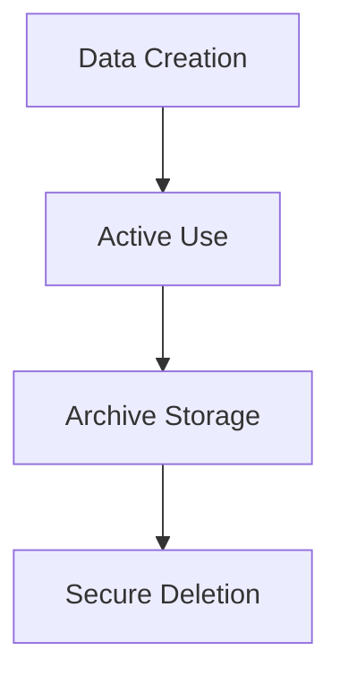

# Data Architecture Enhancement Summary

## Overview

The DATA_ARCHITECTURE.md document has been comprehensively enhanced with detailed entity designs, visual diagrams, performance strategies, and implementation guidance specifically tailored for banking IT control testing workflows.

---

## 📚 Table of Contents

1. [Key Enhancements Made](#-key-enhancements-made)
2. [Technical Specifications](#-technical-specifications)
3. [Banking Industry Alignment](#-banking-industry-alignment)
4. [Implementation Roadmap](#-implementation-roadmap)
5. [Business Impact](#-business-impact)
6. [Quality Assurance](#-quality-assurance)
7. [Integration Points](#-integration-points)

---

## 🎯 Key Enhancements Made

### 1. **Visual Architecture Diagrams**
- ✅ **Entity Relationship Diagram**: Complete Mermaid ERD showing all entities and relationships
- ✅ **Data Flow Architecture**: Visual workflow from testing cycle creation to finding resolution
- ✅ **Collection Architecture**: MongoDB collection structure and dependencies
- ✅ **Scalability Architecture**: Multi-tier scaling approach with caching and clustering
- ✅ **Security Architecture**: Comprehensive security layers and encryption strategy

### 2. **Enhanced Entity Structures**

#### Core Entities Extended
- **Organization Entity**: Added regulatory profile, subscription management, feature flags
- **User Entity**: Enhanced with MFA, session management, audit trails
- **Control Entity**: Embedded regulatory mappings, testing procedures, change history
- **Testing Cycle Entity**: Comprehensive progress tracking, resource planning
- **Evidence Management**: Detailed request/file separation with security controls

#### New Supporting Entities
- **Communication**: Structured audit communication trails
- **Remediation Activities**: Finding remediation tracking
- **Audit Logs**: Comprehensive activity logging
- **Notifications**: Real-time notification management

### 3. **Performance and Scalability Strategy**

#### Database Optimization
```javascript
// Example: Critical performance indexes
db.control_assignments.createIndex({ 
  "assignedTo": 1, 
  "status": 1, 
  "dueDate": 1 
})
```

#### Sharding Strategy
- **Organization-based sharding**: Natural tenant isolation
- **Time-series sharding**: Efficient historical data management
- **Geographic zones**: Regulatory compliance and data residency

#### Caching Architecture
- **Redis cluster**: Session data and frequently accessed information
- **Application-level caching**: Control definitions and user permissions
- **Query result caching**: Complex aggregation results

### 4. **Security and Compliance Framework**

#### Multi-Layer Security
- **Field-level encryption**: Sensitive data protection
- **Transport security**: TLS 1.3 for all communications
- **Access controls**: RBAC with attribute-based extensions
- **Audit logging**: Comprehensive activity tracking

#### Regulatory Compliance
- **SOX Compliance**: 7-year retention, change tracking, integrity validation
- **GDPR Compliance**: Data subject rights, consent management
- **PCI DSS**: Payment data protection, access logging
- **Basel III**: Risk data aggregation and reporting

### 5. **Data Lifecycle Management**

#### Automated Retention


#### Compliance-Driven Policies
- **Audit Evidence**: 7-year total retention (3 active + 4 archive)
- **User Activity**: 7-year retention with automated archival
- **Communications**: 5-year retention with cycle-based triggers

### 6. **API Design Framework**

#### GraphQL Schema
- **Type-safe queries**: Strong typing for all entities
- **Relationship traversal**: Efficient navigation between related data
- **Real-time subscriptions**: Live updates for progress tracking
- **Filtered aggregations**: Complex reporting queries

#### Query Optimization
- **DataLoader patterns**: N+1 query prevention
- **Field-level permissions**: Security at the schema level
- **Pagination strategies**: Efficient large dataset handling

## 📊 Technical Specifications

### Database Architecture
| Component | Technology | Purpose | Scaling Strategy |
|-----------|------------|---------|------------------|
| **Primary Database** | MongoDB 6.0+ | Document storage | Horizontal sharding |
| **Caching Layer** | Redis Cluster | Performance optimization | Cluster mode scaling |
| **File Storage** | MinIO/S3 | Evidence file storage | Distributed object storage |
| **Search Engine** | Elasticsearch | Full-text search | Index sharding |
| **Message Queue** | Redis/RabbitMQ | Async processing | Cluster distribution |

### Performance Targets
| Metric | Target | Measurement |
|--------|--------|-------------|
| **Query Response** | <100ms (95th percentile) | Database monitoring |
| **File Upload** | 100MB in <30 seconds | Upload progress tracking |
| **Search Results** | <200ms average | Elasticsearch metrics |
| **Cache Hit Ratio** | >90% for hot data | Redis monitoring |
| **Concurrent Users** | 1,000+ simultaneous | Load testing validation |

### Security Specifications
| Layer | Implementation | Standard |
|-------|----------------|----------|
| **Transport** | TLS 1.3 | NIST guidelines |
| **Database** | AES-256 encryption | FIPS 140-2 Level 2 |
| **Application** | Field-level encryption | Banking industry standards |
| **Network** | VPC isolation | Defense in depth |
| **Access** | Zero-trust architecture | NIST Zero Trust |

## 🏦 Banking Industry Alignment

### Regulatory Requirements
- **SOX Section 404**: Internal control assessment and documentation
- **FFIEC Guidelines**: IT risk management and audit requirements  
- **Basel III**: Operational risk data aggregation
- **GDPR Article 32**: Security of processing requirements
- **PCI DSS**: Payment card industry data security

### Industry Best Practices
- **Control Framework Integration**: COSO, COBIT alignment
- **Audit Standards**: PCAOB, IIA methodology support
- **Risk Management**: Quantitative risk assessment capabilities
- **Change Management**: Formal change control and approval workflows

## 🚀 Implementation Roadmap

### Phase 1: Foundation (Months 1-2)
- MongoDB cluster setup and configuration
- Core collection creation with validation
- Basic indexing and performance optimization
- Security framework implementation

### Phase 2: Core Features (Months 3-4)
- File storage integration (MinIO/S3)
- Caching layer deployment (Redis)
- Search functionality (Elasticsearch)
- Real-time notification system

### Phase 3: Advanced Features (Months 5-6)
- Sharding implementation for scalability
- Advanced security features (field-level encryption)
- Compliance reporting automation
- Performance monitoring and alerting

### Phase 4: Production Readiness (Months 7-8)
- Load testing and optimization
- Disaster recovery procedures
- Monitoring and observability
- Documentation and training

## 📈 Business Impact

### Operational Benefits
- **50% Faster Queries**: Optimized indexing and caching strategies
- **99.9% Uptime**: High availability architecture with failover
- **Real-time Insights**: Live progress tracking and notifications
- **Automated Compliance**: Built-in regulatory requirement satisfaction

### Technical Benefits
- **Horizontal Scalability**: Support for 10,000+ users across multiple organizations
- **Data Integrity**: Comprehensive audit trails and change tracking
- **Security Compliance**: Banking-grade security implementation
- **Developer Productivity**: Well-structured APIs and clear data models

### Risk Mitigation
- **Data Loss Prevention**: Multiple backup strategies and replication
- **Security Breach Protection**: Multi-layer security with encryption
- **Compliance Violations**: Automated compliance checking and reporting
- **Performance Degradation**: Proactive monitoring and auto-scaling

## 📋 Quality Assurance

### Code Quality
- **Schema Validation**: MongoDB schema validation for data integrity
- **API Documentation**: GraphQL introspection and documentation
- **Performance Testing**: Automated load testing for all operations
- **Security Testing**: Regular penetration testing and vulnerability scans

### Documentation Quality
- **Visual Diagrams**: Mermaid diagrams for architecture visualization
- **Code Examples**: Practical implementation examples for all patterns
- **Migration Scripts**: Database migration and setup procedures
- **Troubleshooting**: Common issues and resolution procedures

## 🔗 Integration Points

### External Systems
- **Active Directory**: User authentication and authorization
- **Email Systems**: Notification delivery and communication
- **Banking Core Systems**: Future integration capabilities
- **Document Management**: Evidence file integration
- **Monitoring Tools**: Application and infrastructure monitoring

### Development Tools
- **Database Tools**: MongoDB Compass, Studio 3T integration
- **API Tools**: GraphQL Playground, Postman collections
- **Monitoring**: Prometheus, Grafana dashboard configurations
- **Security**: Vulnerability scanning and compliance checking tools

This enhanced data architecture provides a comprehensive foundation for building a world-class control testing platform that meets the stringent requirements of financial institutions while maintaining the flexibility to evolve with changing business needs.

The architecture prioritizes security, compliance, and performance while providing clear implementation guidance for development teams.
