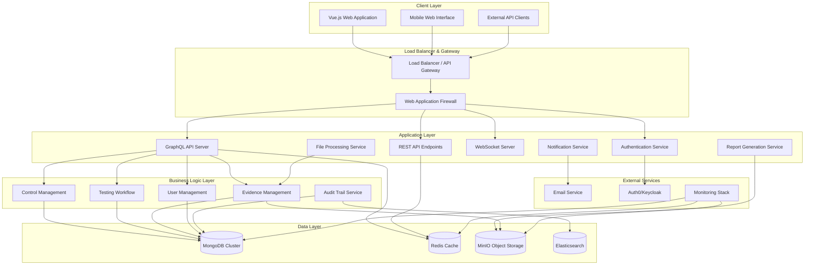
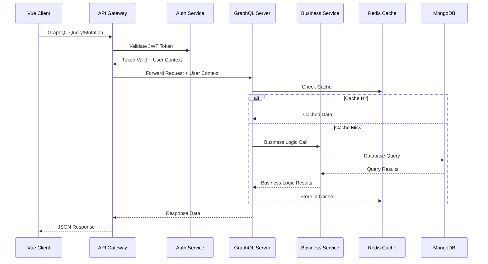
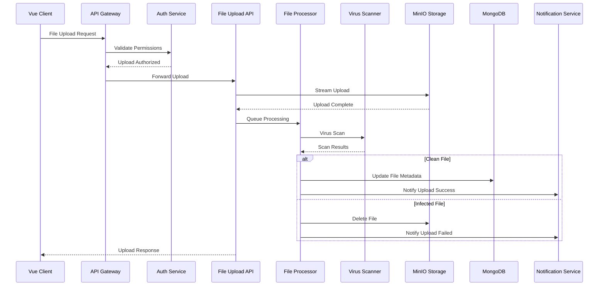
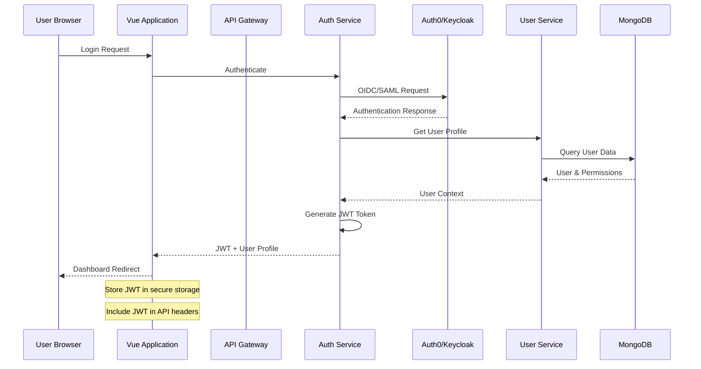
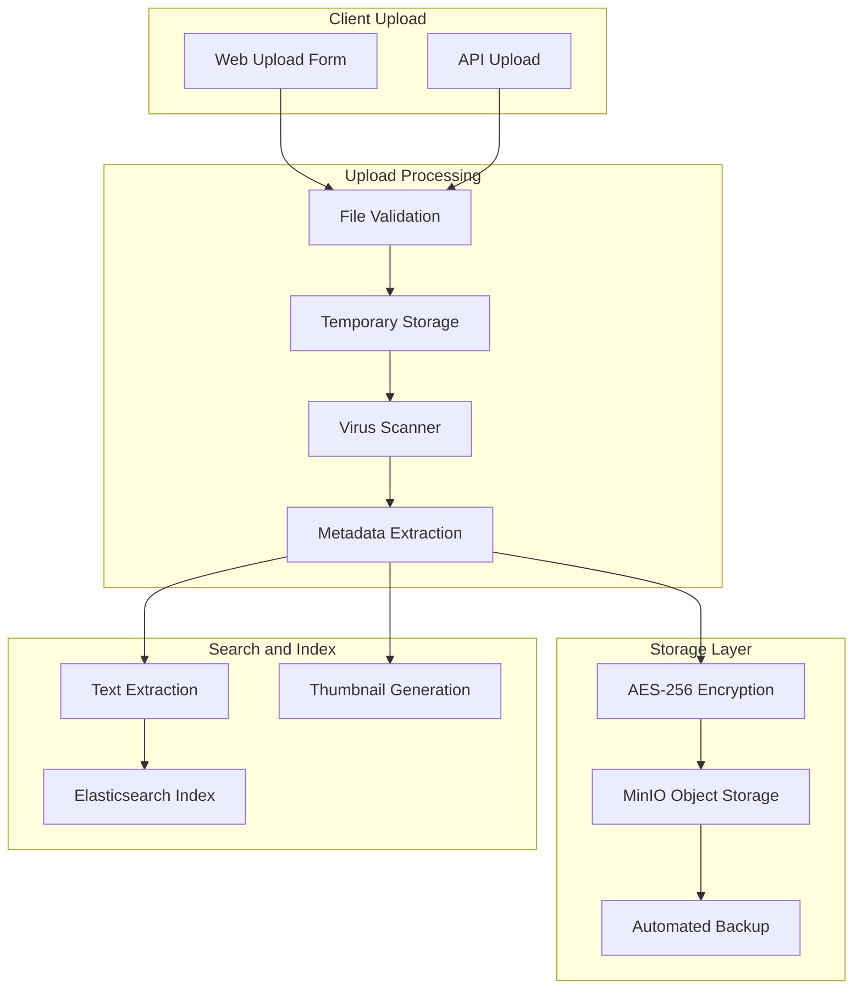
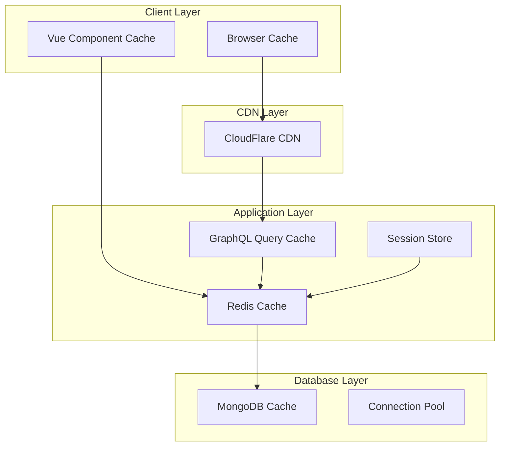
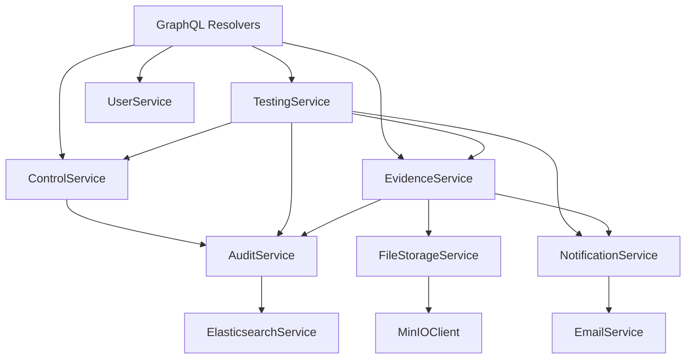

# System Architecture and Component Design

Let me guide you through designing a robust system architecture that transforms your data model into a scalable, secure platform that banking institutions will trust with their most critical audit processes. Think of this as designing the nervous system that connects every component of your application, ensuring information flows efficiently while maintaining the security and reliability that regulatory environments demand.

## Understanding Your Architectural Challenge

Your control testing platform faces unique architectural requirements that distinguish it from typical business applications. You need to support complex, multi-stage workflows that span weeks or months, handle sensitive financial data that requires strict access controls, and maintain comprehensive audit trails that regulators will scrutinize. The architecture must be robust enough to handle peak loads during testing cycles while remaining cost-effective during quieter periods.

The banking domain also introduces constraints around data residency, security controls, and integration capabilities that influence every architectural decision. Your system needs to demonstrate the same level of operational maturity and security rigor that banks expect from their core systems, while remaining agile enough to support rapid feature development and deployment.

## Overall System Architecture

Let me start with the high-level architecture that shows how your major components interact to deliver the complete user experience.

## GoEdu Control Testing Platform - System Architecture

### High-Level Architecture Overview



### Request Flow Architecture

#### Standard GraphQL Query Flow



#### File Upload and Processing Flow



### Component Interaction Matrix

| Component | Interacts With | Purpose | Protocol |
|-----------|---------------|---------|----------|
| Vue Frontend | API Gateway | User interactions | HTTPS/GraphQL |
| API Gateway | Auth Service | Authentication | Internal HTTP |
| GraphQL Server | Business Services | Data operations | Direct function calls |
| Business Services | MongoDB | Data persistence | MongoDB Wire Protocol |
| Business Services | Redis | Caching | Redis Protocol |
| File Processor | MinIO | File storage | S3 API |
| Notification Service | Email Provider | Notifications | SMTP/HTTP |
| Audit Service | Elasticsearch | Log storage | REST API |

### Technology Stack Integration

#### Backend Service Architecture

```go
// Example service interface pattern
type ControlService interface {
    CreateControl(ctx context.Context, input CreateControlInput) (*Control, error)
    GetControl(ctx context.Context, id string) (*Control, error)
    UpdateControl(ctx context.Context, id string, input UpdateControlInput) (*Control, error)
    ListControls(ctx context.Context, filter ControlFilter) (*ControlConnection, error)
    DeleteControl(ctx context.Context, id string) error
}

type TestingService interface {
    CreateTestingCycle(ctx context.Context, input CreateCycleInput) (*TestingCycle, error)
    AssignControlToAuditor(ctx context.Context, input AssignmentInput) (*Assignment, error)
    UpdateTestProgress(ctx context.Context, id string, progress TestProgress) error
    GenerateWorkpaper(ctx context.Context, testID string) (*Document, error)
}

type EvidenceService interface {
    CreateEvidenceRequest(ctx context.Context, input EvidenceRequestInput) (*EvidenceRequest, error)
    UploadEvidence(ctx context.Context, requestID string, files []FileUpload) error
    ProcessEvidenceFile(ctx context.Context, fileID string) error
    GetEvidenceByRequest(ctx context.Context, requestID string) ([]*Evidence, error)
}
```

#### GraphQL Schema Mapping

```graphql
# Core entity types that map to MongoDB documents
type Control {
  id: ID!
  identifier: String!
  title: String!
  description: String!
  controlType: ControlType!
  regulatoryMappings: [RegulatoryMapping!]!
  testingProcedures: TestingProcedures
  controlOwner: User
  status: ControlStatus!
  version: String!
  createdAt: DateTime!
  updatedAt: DateTime!
}

type TestingCycle {
  id: ID!
  name: String!
  description: String
  regulatoryFramework: String!
  testingPeriod: DateRange!
  status: CycleStatus!
  controlAssignments: [ControlAssignment!]!
  overallProgress: CycleProgress!
  cycleManager: User!
  createdAt: DateTime!
}

type EvidenceRequest {
  id: ID!
  requestNumber: String!
  control: Control!
  testingCycle: TestingCycle!
  requestedEvidence: [EvidenceRequirement!]!
  requestedFrom: User!
  requestedBy: User!
  status: RequestStatus!
  dueDate: DateTime!
  submittedEvidence: [EvidenceFile!]!
}

# Query and mutation endpoints
type Query {
  control(id: ID!): Control
  controls(filter: ControlFilter, pagination: PaginationInput): ControlConnection!
  testingCycle(id: ID!): TestingCycle
  testingCycles(filter: CycleFilter): [TestingCycle!]!
  evidenceRequest(id: ID!): EvidenceRequest
  myAssignments: [ControlAssignment!]!
  dashboardData: DashboardData!
}

type Mutation {
  createControl(input: CreateControlInput!): Control!
  updateControl(id: ID!, input: UpdateControlInput!): Control!
  createTestingCycle(input: CreateCycleInput!): TestingCycle!
  assignControl(input: AssignControlInput!): ControlAssignment!
  createEvidenceRequest(input: CreateEvidenceRequestInput!): EvidenceRequest!
  uploadEvidence(requestId: ID!, files: [Upload!]!): [EvidenceFile!]!
  submitTestResults(input: TestResultsInput!): TestExecution!
  createFinding(input: CreateFindingInput!): Finding!
}

type Subscription {
  assignmentUpdated(userId: ID!): ControlAssignment!
  evidenceRequestStatusChanged(requestId: ID!): EvidenceRequest!
  cycleProgressUpdated(cycleId: ID!): CycleProgress!
}
```

### Authentication and Authorization Architecture

#### Authentication Flow



#### Role-Based Access Control (RBAC) Implementation

```go
// Permission structure for granular access control
type Permission struct {
    Resource string `json:"resource"` // e.g., "controls", "testing_cycles"
    Action   string `json:"action"`   // e.g., "read", "write", "delete"
    Scope    string `json:"scope"`    // e.g., "own", "team", "organization"
}

type Role struct {
    ID          string       `json:"id"`
    Name        string       `json:"name"`
    Description string       `json:"description"`
    Permissions []Permission `json:"permissions"`
}

// Built-in roles for banking audit workflows
var DefaultRoles = map[string]Role{
    "auditor": {
        ID:   "auditor",
        Name: "Auditor",
        Permissions: []Permission{
            {Resource: "controls", Action: "read", Scope: "organization"},
            {Resource: "assignments", Action: "read", Scope: "own"},
            {Resource: "assignments", Action: "update", Scope: "own"},
            {Resource: "evidence_requests", Action: "create", Scope: "own"},
            {Resource: "test_executions", Action: "create", Scope: "own"},
            {Resource: "findings", Action: "create", Scope: "own"},
        },
    },
    "audit_manager": {
        ID:   "audit_manager",
        Name: "Audit Manager",
        Permissions: []Permission{
            {Resource: "controls", Action: "read", Scope: "organization"},
            {Resource: "controls", Action: "write", Scope: "organization"},
            {Resource: "testing_cycles", Action: "create", Scope: "team"},
            {Resource: "assignments", Action: "create", Scope: "team"},
            {Resource: "assignments", Action: "read", Scope: "team"},
            {Resource: "reports", Action: "read", Scope: "team"},
        },
    },
    "evidence_provider": {
        ID:   "evidence_provider",
        Name: "Evidence Provider",
        Permissions: []Permission{
            {Resource: "evidence_requests", Action: "read", Scope: "assigned"},
            {Resource: "evidence_files", Action: "upload", Scope: "assigned"},
            {Resource: "evidence_requests", Action: "update", Scope: "assigned"},
        },
    },
}

// Middleware for GraphQL authorization
func AuthorizeField(ctx context.Context, resource, action, scope string) error {
    user := GetUserFromContext(ctx)
    if user == nil {
        return errors.New("unauthorized: no user context")
    }
    
    for _, role := range user.Roles {
        for _, permission := range role.Permissions {
            if permission.Resource == resource && 
               permission.Action == action && 
               (permission.Scope == "organization" || 
                permission.Scope == scope) {
                return nil
            }
        }
    }
    
    return errors.New("forbidden: insufficient permissions")
}
```

#### JWT Token Structure

```json
{
  "iss": "goedu-platform",
  "sub": "user_12345",
  "aud": "goedu-api",
  "exp": 1640995200,
  "iat": 1640908800,
  "user_id": "507f1f77bcf86cd799439011",
  "email": "john.auditor@bank.com",
  "roles": ["auditor"],
  "organization_id": "507f1f77bcf86cd799439012",
  "permissions": [
    "controls:read:organization",
    "assignments:read:own",
    "assignments:update:own"
  ],
  "session_id": "sess_abc123"
}
```

### File Storage and Processing Architecture

#### File Upload and Processing Pipeline



#### File Storage Implementation

```go
type FileStorageService struct {
    minioClient   *minio.Client
    encryptionKey []byte
    virusScanner  VirusScanner
    searcher      SearchIndexer
}

type UploadResult struct {
    FileID      string    `json:"file_id"`
    FileName    string    `json:"file_name"`
    FileSize    int64     `json:"file_size"`
    ContentType string    `json:"content_type"`
    UploadedAt  time.Time `json:"uploaded_at"`
    StoragePath string    `json:"storage_path"`
    Checksum    string    `json:"checksum"`
}

func (fs *FileStorageService) UploadFile(
    ctx context.Context, 
    request *EvidenceRequest, 
    file io.Reader, 
    filename string,
    userID string,
) (*UploadResult, error) {
    // 1. Validate file type and size
    if err := fs.validateFile(filename, file); err != nil {
        return nil, fmt.Errorf("file validation failed: %w", err)
    }
    
    // 2. Generate unique file ID and storage path
    fileID := generateFileID()
    storagePath := generateStoragePath(request.TestingCycleID, request.ControlID, fileID)
    
    // 3. Virus scan in temporary location
    tempFile, err := fs.createTempFile(file)
    if err != nil {
        return nil, fmt.Errorf("temporary file creation failed: %w", err)
    }
    defer os.Remove(tempFile)
    
    scanResult, err := fs.virusScanner.ScanFile(tempFile)
    if err != nil || !scanResult.IsClean {
        return nil, fmt.Errorf("virus scan failed: %v", scanResult.Threats)
    }
    
    // 4. Encrypt and upload to MinIO
    encryptedReader, err := fs.encryptFile(tempFile)
    if err != nil {
        return nil, fmt.Errorf("encryption failed: %w", err)
    }
    
    objectInfo, err := fs.minioClient.PutObject(
        ctx,
        "evidence-files",
        storagePath,
        encryptedReader,
        -1,
        minio.PutObjectOptions{
            ContentType: detectContentType(filename),
            UserMetadata: map[string]string{
                "request-id":     request.ID,
                "uploaded-by":    userID,
                "original-name":  filename,
                "encryption-key": fs.getEncryptionKeyID(),
            },
        },
    )
    if err != nil {
        return nil, fmt.Errorf("storage upload failed: %w", err)
    }
    
    // 5. Extract metadata and index for search
    metadata, err := fs.extractMetadata(tempFile, filename)
    if err != nil {
        log.Printf("metadata extraction failed: %v", err)
        // Non-fatal error, continue with upload
    }
    
    // 6. Index content for search
    go func() {
        if err := fs.indexFileContent(fileID, tempFile, metadata); err != nil {
            log.Printf("search indexing failed: %v", err)
        }
    }()
    
    return &UploadResult{
        FileID:      fileID,
        FileName:    filename,
        FileSize:    objectInfo.Size,
        ContentType: detectContentType(filename),
        UploadedAt:  time.Now(),
        StoragePath: storagePath,
        Checksum:    calculateChecksum(tempFile),
    }, nil
}

// File access with audit logging
func (fs *FileStorageService) GetFile(
    ctx context.Context, 
    fileID string, 
    userID string,
) (io.ReadCloser, *FileMetadata, error) {
    // 1. Check permissions
    if !fs.hasFileAccess(userID, fileID) {
        return nil, nil, errors.New("access denied")
    }
    
    // 2. Log access for audit trail
    fs.logFileAccess(fileID, userID, "download", getUserIP(ctx))
    
    // 3. Retrieve from storage
    file, err := fs.minioClient.GetObject(ctx, "evidence-files", fileID, minio.GetObjectOptions{})
    if err != nil {
        return nil, nil, fmt.Errorf("file retrieval failed: %w", err)
    }
    
    // 4. Decrypt file content
    decryptedFile, err := fs.decryptFile(file)
    if err != nil {
        return nil, nil, fmt.Errorf("decryption failed: %w", err)
    }
    
    metadata, err := fs.getFileMetadata(fileID)
    if err != nil {
        return nil, nil, fmt.Errorf("metadata retrieval failed: %w", err)
    }
    
    return decryptedFile, metadata, nil
}
```

### Caching and Performance Architecture

#### Multi-Layer Caching Strategy



#### Redis Caching Implementation

```go
type CacheService struct {
    client       redis.Cmdable
    defaultTTL   time.Duration
    keyPrefix    string
}

// Cache keys for different data types
const (
    ControlCacheKey     = "control:"
    UserCacheKey       = "user:"
    CycleCacheKey      = "cycle:"
    AssignmentCacheKey = "assignment:"
    PermissionCacheKey = "permissions:"
)

func (cs *CacheService) CacheControl(ctx context.Context, control *Control) error {
    key := cs.keyPrefix + ControlCacheKey + control.ID
    data, err := json.Marshal(control)
    if err != nil {
        return err
    }
    
    return cs.client.Set(ctx, key, data, 1*time.Hour).Err()
}

func (cs *CacheService) GetCachedControl(ctx context.Context, controlID string) (*Control, error) {
    key := cs.keyPrefix + ControlCacheKey + controlID
    data, err := cs.client.Get(ctx, key).Result()
    if err != nil {
        if err == redis.Nil {
            return nil, nil // Cache miss
        }
        return nil, err
    }
    
    var control Control
    if err := json.Unmarshal([]byte(data), &control); err != nil {
        return nil, err
    }
    
    return &control, nil
}

// Cache invalidation patterns
func (cs *CacheService) InvalidateControlCache(ctx context.Context, controlID string) error {
    keys := []string{
        cs.keyPrefix + ControlCacheKey + controlID,
        cs.keyPrefix + "controls:list:*", // Invalidate list caches
    }
    
    for _, key := range keys {
        if strings.Contains(key, "*") {
            // Handle wildcard deletion
            iter := cs.client.Scan(ctx, 0, key, 0).Iterator()
            for iter.Next(ctx) {
                cs.client.Del(ctx, iter.Val())
            }
        } else {
            cs.client.Del(ctx, key)
        }
    }
    
    return nil
}

// Session management in Redis
func (cs *CacheService) StoreUserSession(ctx context.Context, sessionID string, userSession *UserSession) error {
    key := cs.keyPrefix + "session:" + sessionID
    data, err := json.Marshal(userSession)
    if err != nil {
        return err
    }
    
    return cs.client.Set(ctx, key, data, 24*time.Hour).Err()
}
```

### Real-time Communication Architecture

Your platform needs real-time capabilities to support collaborative workflows and provide immediate feedback on testing progress.

#### WebSocket Architecture

```go
type WebSocketManager struct {
    clients    map[string]*websocket.Conn
    register   chan *Client
    unregister chan *Client
    broadcast  chan *Message
    mutex      sync.RWMutex
}

type Client struct {
    ID         string
    UserID     string
    Connection *websocket.Conn
    Send       chan *Message
}

type Message struct {
    Type      string      `json:"type"`
    Payload   interface{} `json:"payload"`
    UserID    string      `json:"user_id,omitempty"`
    Timestamp time.Time   `json:"timestamp"`
}

func (wsm *WebSocketManager) HandleWebSocket(w http.ResponseWriter, r *http.Request) {
    conn, err := websocket.Upgrade(w, r, nil, 1024, 1024)
    if err != nil {
        log.Printf("WebSocket upgrade failed: %v", err)
        return
    }
    
    userID := getUserIDFromToken(r)
    client := &Client{
        ID:         generateClientID(),
        UserID:     userID,
        Connection: conn,
        Send:       make(chan *Message, 256),
    }
    
    wsm.register <- client
    
    go wsm.handleClientMessages(client)
    go wsm.handleClientWrites(client)
}

// Real-time notifications for testing progress
func (wsm *WebSocketManager) NotifyAssignmentUpdate(assignment *Assignment) {
    message := &Message{
        Type: "assignment_updated",
        Payload: map[string]interface{}{
            "assignment_id": assignment.ID,
            "status":       assignment.Status,
            "progress":     assignment.Progress,
        },
        Timestamp: time.Now(),
    }
    
    // Send to assigned auditor
    wsm.sendToUser(assignment.AssignedTo, message)
    
    // Send to audit manager
    wsm.sendToUser(assignment.AssignedBy, message)
}

func (wsm *WebSocketManager) NotifyEvidenceRequestUpdate(request *EvidenceRequest) {
    message := &Message{
        Type: "evidence_request_updated",
        Payload: map[string]interface{}{
            "request_id": request.ID,
            "status":     request.Status,
            "progress":   calculateEvidenceProgress(request),
        },
        Timestamp: time.Now(),
    }
    
    // Notify evidence provider
    wsm.sendToUser(request.RequestedFrom, message)
    
    // Notify requesting auditor
    wsm.sendToUser(request.RequestedBy, message)
}
```

### Service Layer Architecture

The business logic layer implements the core domain workflows while maintaining clean separation between different functional areas. Each service handles a specific aspect of the control testing domain.

#### Service Dependencies



## Key Architectural Decisions and Their Impact

Let me highlight several critical architectural decisions that directly support your business objectives:

**Microservices-oriented design within a monolithic deployment** allows you to maintain the simplicity of a single deployment while organizing code around business domains. This supports rapid development in early phases while providing a clear path to microservices architecture as you scale.

**Multi-layer caching strategy addresses the performance** requirements essential for user adoption. By caching frequently accessed data like control definitions and user permissions in Redis, you ensure that the most common operations respond quickly even under heavy load.

**Event-driven real-time updates through WebSockets** provide the immediate feedback that transforms coordination from a reactive process to a proactive one. When evidence is uploaded or test status changes, all relevant stakeholders know immediately rather than discovering changes through email or manual checking.

**Comprehensive audit logging** built into every layer ensures that your platform not only supports audit processes but can itself withstand audit scrutiny. Every data access, every file download, and every permission change creates an immutable audit trail.

## Implementation Considerations

The architecture I've outlined provides several implementation advantages that will accelerate your development timeline while ensuring production readiness:

**GraphQL schema design** maps directly to your MongoDB document structure, reducing the impedance mismatch between your API and data layer. This allows developers to work efficiently while ensuring that API responses contain exactly the data needed for user interfaces.

**File processing pipeline** handles the complexity of secure file management while providing the flexibility to support different file types and processing requirements. The asynchronous processing model ensures that large file uploads don't block user interactions.

**Authentication and authorization layers** integrate with enterprise identity systems while maintaining fine-grained control over feature access. This enables you to support the complex permission structures found in banking audit departments without requiring customers to change their existing identity management practices.

The distributed locking and optimistic concurrency control patterns prevent data corruption when multiple users work on related data simultaneously, which is essential for maintaining data integrity in collaborative audit workflows.
