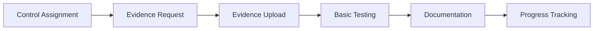
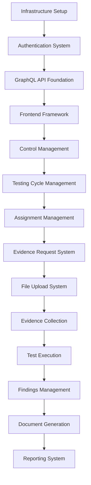

# Technical Implementation Planning

Let me guide you through transforming your comprehensive design work into a practical development roadmap that your team can execute efficiently. Think of this phase as creating the detailed blueprints and construction schedules that turn architectural plans into a functioning building. Every task needs clear dependencies, realistic time estimates, and defined acceptance criteria.

Your control testing platform presents unique implementation challenges because it must deliver immediate value to justify adoption while building toward the comprehensive functionality that creates long-term competitive advantage. This requires a sophisticated approach to phasing that delivers complete workflows incrementally rather than partial functionality across all features

## Minimum Viable Product (MVP) Definition

The MVP for your control testing platform must support one complete end-to-end workflow that demonstrates clear value over current manual processes. Based on your business objectives and user research, the MVP should enable an auditor to receive a control assignment, collect evidence, perform basic testing, and generate documentation - all with measurably less coordination overhead than current manual processes.

### MVP Scope: Core Control Testing Workflow

The MVP delivers one complete control testing workflow that demonstrates measurable value over manual processes:



### MVP Success Criteria

- **Functional**: Complete one control test from assignment to documentation
- **Performance**: 50% reduction in evidence collection coordination time
- **Adoption**: 10 pilot users successfully complete control testing workflows
- **Quality**: Zero data loss, 99% uptime during pilot period

### MVP Feature Set

#### Core Features (Must Have)

- [ ] User authentication with role-based access (3 roles: Admin, Auditor, Evidence Provider)
- [ ] Control definition and management (CRUD operations)
- [ ] Simple testing cycle creation and management
- [ ] Control assignment to auditors
- [ ] Evidence request generation and routing
- [ ] File upload and basic validation (virus scanning, file type checks)
- [ ] Evidence collection status tracking
- [ ] Basic test execution interface
- [ ] Simple workpaper generation (PDF export)
- [ ] Dashboard with assignment overview

#### Excluded from MVP (Future Phases)

- ❌ Advanced analytics and reporting
- ❌ Real-time collaboration features
- ❌ Mobile-optimized interfaces
- ❌ Advanced file processing (OCR, metadata extraction)
- ❌ Integration with external systems
- ❌ Complex workflow customization
- ❌ Advanced audit trail features

## Implementation Phases

### Phase 1: Foundation Infrastructure (Weeks 1-4)

**Objective**: Establish core technical infrastructure and basic user management

#### Sprint 1.1: Development Environment & Core Infrastructure (Week 1)

```yaml
Tasks:
  - Setup development environment (Docker, Go, Vue.js)
  - Initialize project structure and repositories
  - Configure CI/CD pipeline with GitHub Actions
  - Setup MongoDB cluster (development and staging)
  - Configure Redis for caching and sessions
  - Setup MinIO for object storage
  - Implement basic health check endpoints

Dependencies: None
Team: DevOps + Backend Lead
Deliverables:
  - Working development environment
  - Automated deployment pipeline
  - Basic monitoring and logging
```

#### Sprint 1.2: Authentication & User Management (Week 2)

```yaml
Tasks:
  - Implement JWT-based authentication
  - Create user registration and login endpoints
  - Setup role-based access control (RBAC)
  - Implement password policies and security
  - Create basic user management interface
  - Setup session management with Redis

Dependencies: Infrastructure setup
Team: Backend + Security Lead
Deliverables:
  - User authentication system
  - Basic user management interface
  - Security audit documentation
```

#### Sprint 1.3: GraphQL API Foundation (Week 3)

```yaml
Tasks:
  - Setup gqlgen and schema generation
  - Implement basic GraphQL server
  - Create core resolvers (User, Organization)
  - Setup GraphQL middleware (auth, logging, caching)
  - Implement basic error handling
  - Create API documentation

Dependencies: Authentication system
Team: Backend Lead + API Developer
Deliverables:
  - GraphQL API server
  - Core schema definitions
  - API documentation
```

#### Sprint 1.4: Frontend Foundation (Week 4)

```yaml
Tasks:
  - Setup Vue.js application with Material Design
  - Implement authentication components
  - Create basic layout and navigation
  - Setup GraphQL client (Apollo)
  - Implement responsive design framework
  - Create component library foundation

Dependencies: GraphQL API
Team: Frontend Lead + UI Developer
Deliverables:
  - Vue.js application framework
  - Authentication interface
  - Component library
```

### Phase 2: Core Domain Implementation (Weeks 5-8)

**Objective**: Implement control management and testing cycle functionality

#### Sprint 2.1: Control Management (Week 5)

```yaml
Tasks:
  - Design and implement Control data model
  - Create control CRUD operations
  - Implement regulatory framework mappings
  - Build control management interface
  - Add control versioning and history
  - Implement control search and filtering

Dependencies: GraphQL API, Frontend foundation
Team: Backend + Frontend Developer
Deliverables:
  - Control management system
  - Control library interface
  - Search and filtering capabilities

Database Schema:
  Controls Collection:
    - _id, identifier, title, description
    - controlType, regulatoryMappings
    - testingProcedures, status, version
    - createdAt, updatedAt, createdBy
```

#### Sprint 2.2: Testing Cycle Management (Week 6)

```yaml
Tasks:
  - Implement TestingCycle data model
  - Create cycle CRUD operations
  - Implement cycle status management
  - Build cycle management interface
  - Add progress calculation logic
  - Create cycle dashboard view

Dependencies: Control management
Team: Backend + Frontend Developer
Deliverables:
  - Testing cycle management
  - Cycle dashboard interface
  - Progress tracking system

Database Schema:
  TestingCycles Collection:
    - _id, name, description, regulatoryFramework
    - testingPeriod, cycleDates, status
    - controlAssignments, overallProgress
    - cycleManager, organizationId
```

#### Sprint 2.3: Assignment Management (Week 7)

```yaml
Tasks:
  - Implement assignment data model
  - Create assignment operations
  - Build assignment interface for managers
  - Implement assignment notifications
  - Create auditor assignment dashboard
  - Add workload balancing features

Dependencies: Testing cycle management
Team: Backend + Frontend Developer
Deliverables:
  - Assignment management system
  - Auditor dashboard
  - Notification system
```

#### Sprint 2.4: User Dashboard Integration (Week 8)

```yaml
Tasks:
  - Create role-specific dashboards
  - Implement real-time status updates
  - Add activity feeds
  - Create progress visualization
  - Implement dashboard customization
  - Add quick action capabilities

Dependencies: Assignment management
Team: Frontend Lead + UI Developer
Deliverables:
  - Complete dashboard interface
  - Real-time updates
  - Progress visualization
```

### Phase 3: Evidence Management (Weeks 9-12)

**Objective**: Implement evidence collection and file management

#### Sprint 3.1: Evidence Request System (Week 9)

```yaml
Tasks:
  - Implement EvidenceRequest data model
  - Create evidence request operations
  - Build request generation interface
  - Implement request routing logic
  - Add request status tracking
  - Create evidence provider interface

Dependencies: Assignment management
Team: Backend + Frontend Developer
Deliverables:
  - Evidence request system
  - Request generation interface
  - Evidence provider portal
```

#### Sprint 3.2: File Upload and Storage (Week 10)

```yaml
Tasks:
  - Implement secure file upload endpoint
  - Setup virus scanning integration
  - Create file storage service (MinIO)
  - Implement file validation
  - Build upload interface with progress
  - Add file metadata management

Dependencies: Evidence request system
Team: Backend + DevOps
Deliverables:
  - Secure file upload system
  - File storage infrastructure
  - Upload interface with validation

Technical Implementation:
  Go Backend:
    - Multipart file handling
    - Stream processing for large files
    - Virus scanning integration
    - File type validation
    - Metadata extraction
  
  Vue Frontend:
    - Drag-and-drop upload
    - Progress indicators
    - File preview capabilities
    - Error handling
```

#### Sprint 3.3: Evidence Collection Workflow (Week 11)

```yaml
Tasks:
  - Implement evidence-request linking
  - Create collection status tracking
  - Build evidence review interface
  - Add evidence validation
  - Implement file organization
  - Create evidence search capabilities

Dependencies: File upload system
Team: Backend + Frontend Developer
Deliverables:
  - Evidence collection workflow
  - Evidence review interface
  - File organization system
```

#### Sprint 3.4: Communication and Notifications (Week 12)

```yaml
Tasks:
  - Implement email notification service
  - Create in-app notification system
  - Build communication thread interface
  - Add reminder and escalation logic
  - Implement notification preferences
  - Create notification dashboard

Dependencies: Evidence collection workflow
Team: Backend + Frontend Developer
Deliverables:
  - Notification system
  - Communication interface
  - Reminder and escalation logic
```

### Phase 4: Testing and Documentation (Weeks 13-16)

**Objective**: Implement test execution and documentation generation

#### Sprint 4.1: Test Execution Framework (Week 13)

```yaml
Tasks:
  - Implement TestExecution data model
  - Create testing interface
  - Add sample selection capabilities
  - Implement testing methodology tracking
  - Build test progress tracking
  - Create exception handling interface

Dependencies: Evidence collection
Team: Backend + Frontend Developer
Deliverables:
  - Test execution framework
  - Testing interface
  - Sample selection tools
```

#### Sprint 4.2: Findings Management (Week 14)

```yaml
Tasks:
  - Implement Finding data model
  - Create findings documentation interface
  - Add severity classification
  - Implement root cause analysis
  - Build findings review workflow
  - Create findings reporting

Dependencies: Test execution
Team: Backend + Frontend Developer
Deliverables:
  - Findings management system
  - Findings documentation interface
  - Review workflow
```

#### Sprint 4.3: Document Generation (Week 15)

```yaml
Tasks:
  - Implement PDF generation service
  - Create workpaper templates
  - Build document generation interface
  - Add template customization
  - Implement document versioning
  - Create document approval workflow

Dependencies: Findings management
Team: Backend + Frontend Developer
Deliverables:
  - Document generation system
  - Workpaper templates
  - Approval workflow

Technical Implementation:
  Go Backend:
    - PDF generation with templates
    - Document metadata management
    - Version control system
    - Digital signature support
  
  Vue Frontend:
    - Document preview interface
    - Template editor
    - Approval workflow UI
```

#### Sprint 4.4: Reporting and Analytics (Week 16)

```yaml
Tasks:
  - Implement basic reporting system
  - Create progress reports
  - Build cycle summary reports
  - Add export capabilities
  - Implement report scheduling
  - Create report distribution

Dependencies: Document generation
Team: Backend + Frontend Developer
Deliverables:
  - Reporting system
  - Progress dashboards
  - Export capabilities
```

## Technical Dependencies and Build Order

### Critical Path Dependencies



### Parallel Development Opportunities

```mermaid
gantt
    title Development Timeline (16 Weeks)
    dateFormat X
    axisFormat %s
    
    section Infrastructure
    Dev Environment    :done, infra1, 0, 1w
    Authentication     :done, auth1, after infra1, 1w
    GraphQL API        :active, api1, after auth1, 1w
    Frontend Setup     :active, fe1, after api1, 1w
    
    section Core Domain
    Control Management :ctrl1, after fe1, 1w
    Testing Cycles     :cycle1, after ctrl1, 1w
    Assignment Mgmt    :assign1, after cycle1, 1w
    Dashboard          :dash1, after assign1, 1w
    
    section Evidence
    Request System     :evid1, after dash1, 1w
    File Upload        :file1, after evid1, 1w
    Collection Flow    :collect1, after file1, 1w
    Notifications      :notif1, after collect1, 1w
    
    section Testing
    Test Execution     :test1, after notif1, 1w
    Findings Mgmt      :find1, after test1, 1w
    Document Gen       :doc1, after find1, 1w
    Reporting          :report1, after doc1, 1w
```



## Team Structure and Role Assignments

### Recommended Team Composition

```yaml
Core Team (6-8 people):
  
  Technical Lead (1):
    - Overall architecture oversight
    - Code review and quality assurance
    - Technical decision making
    - Team coordination
    
  Backend Developers (2-3):
    - Go/GraphQL implementation
    - Database design and optimization
    - API development
    - Security implementation
    
  Frontend Developers (2):
    - Vue.js application development
    - Component library creation
    - User interface implementation
    - Mobile responsiveness
    
  DevOps Engineer (1):
    - Infrastructure setup and management
    - CI/CD pipeline maintenance
    - Monitoring and logging
    - Security compliance
    
  QA Engineer (1):
    - Test strategy and execution
    - Automated testing setup
    - Performance testing
    - Security testing

Extended Team (as needed):
  
  UX Designer (0.5 FTE):
    - User research and validation
    - Interface design refinement
    - Usability testing
    
  Security Consultant (0.25 FTE):
    - Security architecture review
    - Compliance assessment
    - Penetration testing
    
  Domain Expert (0.25 FTE):
    - Requirements validation
    - User acceptance testing
    - Training material development
```

## Development Methodology and Practices

### Agile/Scrum Implementation

```yaml
Sprint Configuration:
  Duration: 1 week sprints
  Planning: Monday morning (2 hours)
  Daily Standups: 15 minutes, same time daily
  Sprint Review: Friday afternoon (1 hour)
  Retrospective: Friday afternoon (30 minutes)

Quality Gates:
  Code Review: All code must be reviewed by 2+ team members
  Testing: 80% unit test coverage required
  Security: Security scan required for each release
  Performance: Load testing for backend changes

Definition of Done:
  - Feature implemented according to acceptance criteria
  - Unit tests written and passing (80% coverage)
  - Integration tests passing
  - Code reviewed and approved
  - Documentation updated
  - Security scan passed
  - Performance benchmarks met
```

### Technical Standards and Practices

```yaml
Backend Development (Go):
  Architecture: Clean Architecture with dependency injection
  API Design: GraphQL with REST fallbacks
  Database: MongoDB with proper indexing
  Testing: Table-driven tests with testify
  Documentation: GoDoc comments for all public functions
  Error Handling: Structured error responses
  Logging: Structured logging with correlation IDs

Frontend Development (Vue.js):
  Architecture: Component-based with Vuex for state management
  UI Framework: Material Design with customizations
  Testing: Jest for unit tests, Cypress for E2E
  Code Style: ESLint + Prettier configuration
  Documentation: Storybook for component documentation
  Performance: Lazy loading and code splitting

DevOps Practices:
  Containerization: Docker for all services
  Orchestration: Kubernetes for production deployment
  CI/CD: GitHub Actions with automated testing
  Monitoring: Prometheus + Grafana
  Logging: ELK stack for centralized logging
  Security: Regular vulnerability scanning
```

## Risk Mitigation Strategies

### Technical Risks and Mitigation

```yaml
High Priority Risks:

Database Performance:
  Risk: MongoDB queries become slow with large datasets
  Mitigation: 
    - Implement proper indexing strategy
    - Use aggregation pipelines efficiently
    - Regular performance testing
    - Caching strategy with Redis
  Timeline Impact: Could delay Phase 2 by 1-2 weeks

File Upload Scalability:
  Risk: Large file uploads impact system performance
  Mitigation:
    - Implement streaming uploads
    - Use background processing
    - Set appropriate file size limits
    - Load testing with large files
  Timeline Impact: Could delay Phase 3 by 1 week

Security Compliance:
  Risk: Banking security requirements not met
  Mitigation:
    - Early security audit engagement
    - Regular penetration testing
    - Compliance checklist validation
    - External security consultant review
  Timeline Impact: Could delay overall launch by 2-4 weeks

Integration Complexity:
  Risk: Third-party service integration failures
  Mitigation:
    - Implement circuit breaker patterns
    - Design for graceful degradation
    - Comprehensive error handling
    - Service health monitoring
  Timeline Impact: Could delay individual features by 1 week
```

### Resource Risks and Mitigation

```yaml
Team Scaling:
  Risk: Difficulty hiring qualified developers
  Mitigation:
    - Start recruiting early
    - Consider remote team members
    - Cross-train existing team members
    - Use contractor resources for specific skills

Domain Knowledge:
  Risk: Insufficient understanding of audit workflows
  Mitigation:
    - Regular stakeholder engagement
    - User research sessions
    - Domain expert consultation
    - Iterative feedback cycles

Technology Changes:
  Risk: Framework updates breaking existing code
  Mitigation:
    - Pin dependency versions
    - Regular dependency updates in controlled manner
    - Comprehensive test coverage
    - Staging environment validation
```

## Quality Assurance Strategy

### Testing Strategy

```yaml
Unit Testing:
  Coverage Target: 80% for backend, 70% for frontend
  Tools: Go testing package, Jest for Vue.js
  Scope: Individual functions and components
  Automation: Run on every commit

Integration Testing:
  Scope: API endpoints, database operations
  Tools: Go testing with MongoDB test instance
  Frequency: Run on every pull request
  Environment: Dedicated test environment

End-to-End Testing:
  Scope: Complete user workflows
  Tools: Cypress for browser automation
  Frequency: Run nightly and before releases
  Coverage: Critical user paths

Performance Testing:
  Scope: API response times, database queries
  Tools: Apache JMeter, Go benchmarks
  Frequency: Weekly during development
  Targets: API responses <500ms, page loads <3s

Security Testing:
  Scope: Authentication, authorization, data protection
  Tools: OWASP ZAP, gosec for static analysis
  Frequency: Before each release
  Coverage: OWASP Top 10 vulnerabilities

User Acceptance Testing:
  Scope: Complete workflows with real users
  Participants: 3-5 audit professionals
  Frequency: End of each phase
  Criteria: Task completion rate >90%
```

## Deployment and Infrastructure Strategy

### Environment Strategy

```yaml
Development:
  Purpose: Individual developer work
  Infrastructure: Local Docker compose
  Database: Single MongoDB instance
  Deployment: Manual, developer-triggered
  Monitoring: Basic logging only

Staging:
  Purpose: Integration testing and demos
  Infrastructure: Kubernetes cluster (3 nodes)
  Database: MongoDB replica set
  Deployment: Automated on merge to develop
  Monitoring: Full monitoring stack
  Data: Sanitized production data

Production:
  Purpose: Live customer usage
  Infrastructure: Kubernetes cluster (5+ nodes)
  Database: MongoDB sharded cluster
  Deployment: Manual approval required
  Monitoring: Full stack with alerting
  Backup: Automated daily backups
```

### Release Strategy

```yaml
Release Schedule:
  MVP Release: Week 16 (Phase 4 completion)
  Feature Releases: Every 2 weeks after MVP
  Security Patches: As needed, within 24-48 hours
  Major Releases: Quarterly

Deployment Process:
  1. Automated testing in staging environment
  2. Security scan and approval
  3. Performance validation
  4. Stakeholder sign-off
  5. Blue-green deployment to production
  6. Post-deployment monitoring
  7. Rollback plan if issues detected

Rollback Strategy:
  Database: Point-in-time recovery capability
  Application: Previous version container images
  Files: MinIO versioning and backup
  Timeline: <30 minutes for application rollback
```

This comprehensive implementation plan provides a realistic roadmap for transforming your design work into a functioning control testing platform. The phased approach ensures that you deliver value incrementally while building toward the comprehensive functionality that creates long-term competitive advantage.

The 16-week timeline is aggressive but achievable with the right team and dedicated focus. The key to success will be maintaining strict scope discipline during each phase and ensuring that technical decisions support both immediate delivery needs and long-term scalability requirements.

Would you like me to elaborate on any specific aspect of the implementation plan, such as the detailed technical specifications for a particular phase, or the specific development practices and tooling recommendations?

## Strategic Implementation Insights

Let me highlight several critical aspects of this implementation plan that directly impact your project's success and timeline.

MVP-First Philosophy: The 16-week timeline to a functioning MVP is aggressive but realistic because it focuses on delivering one complete workflow exceptionally well rather than partial functionality across many features. This approach ensures that your pilot users can actually replace their manual processes rather than just supplementing them with another tool.

Technical Debt Prevention: The foundation-first approach in Phases 1 and 2 invests heavily in infrastructure and core domain modeling before building user-facing features. This prevents the technical debt that often cripples rapid development in later phases. By week 8, you'll have robust authentication, data models, and API foundations that can support rapid feature development.

Risk-Driven Sequencing: The build order prioritizes the highest-risk technical challenges early. File upload and processing (Phase 3) is often where banking applications encounter security and performance bottlenecks, so addressing this before test execution and reporting ensures you don't discover deal-breaking issues late in development.

Domain Complexity Management: Each phase includes both backend implementation and frontend interfaces, ensuring that domain complexity gets addressed incrementally rather than creating a massive integration challenge at the end. This is particularly important for audit workflows where user experience directly impacts adoption.

## Critical Success Factors

Security-First Development: Banking applications face scrutiny that consumer applications never encounter. The implementation plan builds security considerations into every sprint rather than treating them as afterthoughts. The weekly security scans and compliance checkpoints ensure that you discover issues when they're easier to fix.

Performance Architecture: The caching strategy with Redis and the database indexing approach address performance proactively rather than reactively. Control testing generates complex queries across related data (controls, assignments, evidence, findings), so performance optimization can't be an afterthought.

Stakeholder Engagement: The weekly sprint reviews and end-of-phase user acceptance testing keep domain experts engaged throughout development. This prevents the common problem where technical teams build functionally correct but practically unusable software.

## Implementation Flexibility

While the plan provides detailed weekly schedules, successful execution requires flexibility around three key areas:

Feature Scope Adjustment: If development velocity differs from estimates, the plan provides clear guidance about which features can be moved between phases without breaking dependencies. The evidence notification system, for example, could be simplified in Phase 3 and enhanced in a later release without impacting core workflows.

Technical Architecture Evolution: The microservices-oriented design within a monolithic deployment provides flexibility to extract services as the application scales. This architectural approach supports both rapid initial development and long-term scalability without requiring architectural rewrites.

Team Scaling Strategy: The plan accommodates team size variations from 4-8 people by clearly defining which roles are essential and which can be shared or contracted. This flexibility is crucial for startup environments where team composition may change during development.
Quality Gates and Decision Points

Phase Completion Criteria: Each phase includes specific technical and functional milestones that must be met before proceeding. This prevents the accumulation of technical debt and ensures that later phases build on solid foundations.

Go/No-Go Decision Points: Week 8 (end of Phase 2) and Week 12 (end of Phase 3) represent critical decision points where you should evaluate progress against business objectives and make scope adjustments if necessary.

Market Validation Integration: The plan includes specific points for user feedback and market validation, ensuring that development work remains aligned with actual user needs rather than theoretical requirements.

## Post-MVP Roadmap Considerations

The implementation plan deliberately focuses on MVP delivery, but it establishes architectural foundations that support rapid post-MVP development:

Advanced Analytics: The data architecture supports sophisticated reporting and analytics without requiring schema changes.

Third-Party Integrations: The API-first approach and service-oriented architecture make it straightforward to add integrations with banking core systems.

Mobile Applications: The GraphQL API and responsive design foundations support native mobile app development.

Enterprise Features: The authentication and authorization architecture scales to support enterprise identity management integration.

## Implementation Risk Mitigation

Technical Risk Management: The plan addresses the highest-probability risks (database performance, file upload scalability, security compliance) with specific mitigation strategies and timeline buffers.

Resource Risk Management: The team structure and skill requirements are designed to be achievable in the current job market, with fallback strategies for key skill gaps.

Market Risk Management: The MVP definition and user validation checkpoints ensure that development work remains aligned with market needs even if initial assumptions prove incorrect.

This implementation plan transforms your comprehensive design work into actionable development tasks while maintaining the flexibility needed for startup environments. The key to successful execution will be maintaining discipline around scope management while ensuring that each phase delivers meaningful value to your target users.

The 16-week timeline to MVP represents an aggressive but achievable goal that positions you to compete effectively in the control testing market while establishing the technical foundations needed for long-term success.

Would you like me to dive deeper into any specific aspect of this implementation plan? For example, I could provide detailed technical specifications for the file upload system, create comprehensive API documentation for the GraphQL schema, or develop detailed test plans for the security compliance requirements.
