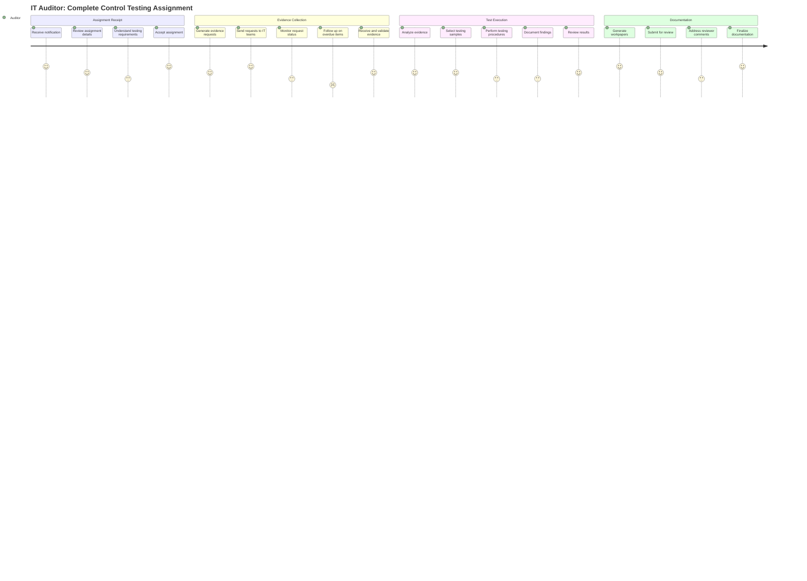
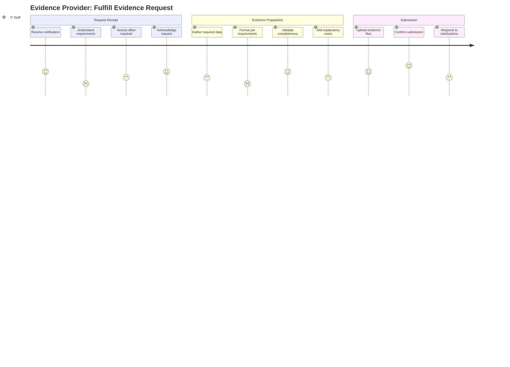
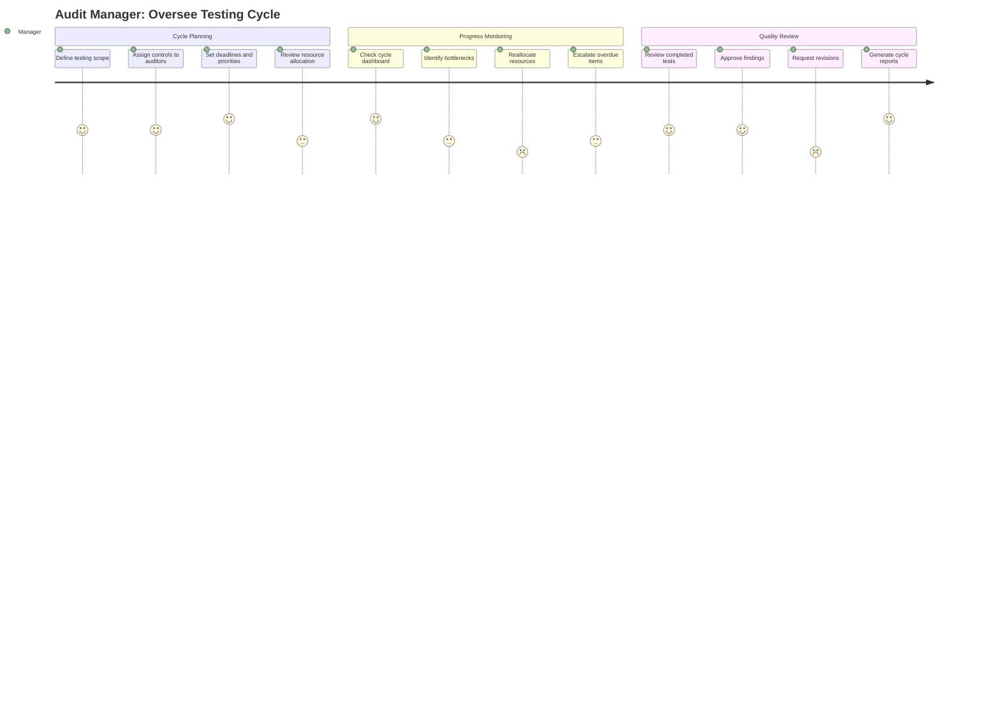
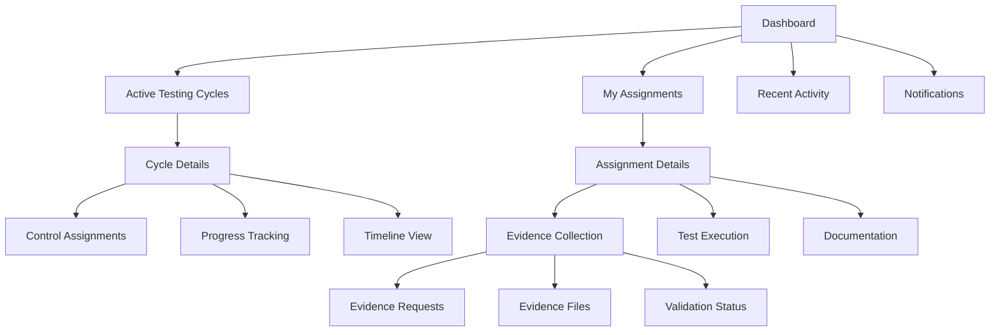

# User Experience and Interface Design

Let me guide you through designing user experiences that transform the complex coordination challenges of control testing into intuitive, efficient workflows. Think of this phase as designing the actual rooms where people will work - every layout decision needs to support natural work patterns while reducing cognitive load and coordination overhead.

Your control testing platform serves users who operate in high-stakes environments where mistakes have regulatory consequences. The interface design must balance comprehensive functionality with clarity and efficiency. Unlike consumer applications where users might explore features casually, audit professionals need to complete specific tasks accurately and efficiently within tight deadlines.

## Understanding Your Users' Mental Models

Before designing specific interfaces, let's understand how each user persona thinks about their work and what mental models they bring to your application.

**IT Auditors** think in terms of control assignments, evidence requirements, and testing procedures. Their mental model follows a linear progression from assignment to completion, but they need flexibility to handle exceptions and findings that emerge during testing. They switch frequently between high-level progress tracking and detailed evidence analysis.

**Audit Managers** think hierarchically - from testing cycles down to individual assignments. They need rapid assessment capabilities to identify bottlenecks and resource allocation issues. Their mental model emphasizes oversight, coordination, and risk management.

**Evidence Providers** think reactively - responding to requests while maintaining their primary IT operations responsibilities. They need immediate clarity about what's required and when, with minimal cognitive overhead for understanding audit context.

Let me create comprehensive user journey maps and interface designs that support these different mental models.

## GoEdu Control Testing Platform - User Experience Design

## User Journey Maps

### Primary User Journey: IT Auditor Control Testing Workflow



### Evidence Provider Journey: Responding to Evidence Requests



### Audit Manager Journey: Monitoring Testing Progress



## Information Architecture and Navigation Design

### Primary Navigation Structure

```
Dashboard
├── My Assignments (Auditors)
├── Testing Cycles (Managers)
├── Evidence Requests (All Users)
├── Controls Library (All Users)
├── Reports (Managers/Compliance)
└── Administration (Admins)

Secondary Navigation (Contextual)
├── Cycle Details
│   ├── Overview
│   ├── Assignments
│   ├── Progress
│   └── Findings
├── Control Details
│   ├── Definition
│   ├── Testing Procedures
│   ├── History
│   └── Assignments
└── Assignment Details
    ├── Requirements
    ├── Evidence
    ├── Testing
    └── Documentation
```

### Information Hierarchy Design



## Dashboard Interface Design

### IT Auditor Dashboard

```
┌─────────────────────────────────────────────────────────────────┐
│ GoEdu Control Testing Platform            🔔 3  👤 John Smith  │
├─────────────────────────────────────────────────────────────────┤
│                                                                 │
│ Welcome back, John! You have 5 active assignments              │
│                                                                 │
│ ┌─── My Active Assignments ──────────────────────────────────┐ │
│ │                                                            │ │
│ │ 🔴 ITGC-001 Logical Access Controls    Due: Aug 15, 2025  │ │
│ │    Evidence Collection: 3/5 complete                      │ │
│ │    [Continue Testing] [View Evidence]                     │ │
│ │                                                            │ │
│ │ 🟡 ITGC-015 Change Management          Due: Aug 20, 2025  │ │
│ │    Testing: In Progress                                   │ │
│ │    [Continue Testing] [View Details]                      │ │
│ │                                                            │ │
│ │ 🟢 ITGC-032 Database Access            Due: Aug 25, 2025  │ │
│ │    Evidence Collection: Pending                           │ │
│ │    [Start Testing] [View Requirements]                    │ │
│ │                                                            │ │
│ │ [View All Assignments]                                    │ │
│ └────────────────────────────────────────────────────────────┘ │
│                                                                 │
│ ┌─── Recent Activity ──────────────────────────────────────┐  │
│ │ • Evidence uploaded for ITGC-001 (2 hours ago)          │  │
│ │ • New assignment: ITGC-045 (Yesterday)                  │  │
│ │ • Workpaper approved for ITGC-028 (2 days ago)         │  │
│ │ [View All Activity]                                      │  │
│ └──────────────────────────────────────────────────────────┘  │
│                                                                 │
│ ┌─── Evidence Requests Status ────────────────────────────┐    │
│ │ Pending Responses: 7    Overdue: 2    Completed: 15    │    │
│ │ [Manage Requests]                                        │    │
│ └──────────────────────────────────────────────────────────┘    │
└─────────────────────────────────────────────────────────────────┘
```

### Audit Manager Dashboard

```
┌─────────────────────────────────────────────────────────────────┐
│ GoEdu Control Testing Platform            🔔 5  👤 Sarah Manager │
├─────────────────────────────────────────────────────────────────┤
│                                                                 │
│ Q3 2025 SOX Testing Cycle Overview                             │
│                                                                 │
│ ┌─── Cycle Progress ───────────────────────────────────────┐   │
│ │                                                          │   │
│ │ Overall Progress: 68% ████████████████░░░░░░░░           │   │
│ │ 31/45 controls completed                                │   │
│ │                                                          │   │
│ │ Status Breakdown:                                        │   │
│ │ ✅ Completed: 31    🔄 In Progress: 9    🔴 Overdue: 5  │   │
│ │                                                          │   │
│ │ [View Detailed Progress] [Generate Report]              │   │
│ └──────────────────────────────────────────────────────────┘   │
│                                                                 │
│ ┌─── Team Workload ──────────────┐ ┌─── Critical Issues ────┐ │
│ │ John Smith:    75% (3/4)       │ │ 🚨 5 overdue controls  │ │
│ │ Lisa Johnson: 100% (5/5)       │ │ 🚨 2 evidence requests │ │
│ │ Mike Chen:     60% (3/5)       │ │    overdue >1 week     │ │
│ │ Amy Davis:     25% (1/4)       │ │ ⚠️  3 controls need    │ │
│ │                                │ │    reviewer approval   │ │
│ │ [Rebalance Workload]          │ │ [Address Issues]       │ │
│ └────────────────────────────────┘ └────────────────────────┘ │
│                                                                 │
│ ┌─── Recent Findings ──────────────────────────────────────┐   │
│ │ 🔴 Significant Deficiency: User Access Review Process   │   │
│ │    Control: ITGC-001, Auditor: John Smith              │   │
│ │    [Review Finding] [Assign for Remediation]           │   │
│ │                                                          │   │
│ │ 🟡 Control Deficiency: Database Change Controls        │   │
│ │    Control: ITGC-015, Auditor: Lisa Johnson           │   │
│ │    [Review Finding] [Schedule Follow-up]               │   │
│ └──────────────────────────────────────────────────────────┘   │
└─────────────────────────────────────────────────────────────────┘
```

## Assignment Detail Interface Design

### Control Assignment View for Auditors

```
┌─────────────────────────────────────────────────────────────────┐
│ ← Back to Dashboard    ITGC-001: Logical Access Controls       │
├─────────────────────────────────────────────────────────────────┤
│                                                                 │
│ ┌─── Assignment Overview ─────────────────────────────────────┐ │
│ │ Control: ITGC-001 - Logical Access Controls                │ │
│ │ Testing Cycle: Q3 2025 SOX Testing                         │ │
│ │ Assigned to: John Smith                                     │ │
│ │ Due Date: August 15, 2025 (5 days remaining)              │ │
│ │ Status: Evidence Collection 🔄                             │ │
│ │ Priority: High                                              │ │
│ └─────────────────────────────────────────────────────────────┘ │
│                                                                 │
│ Tab Navigation: [Requirements] [Evidence] [Testing] [Documentation] │
│                                                                 │
│ ┌─── Evidence Collection Status ─────────────────────────────┐ │
│ │                                                            │ │
│ │ Progress: 3/5 evidence items collected                    │ │
│ │ ████████████░░░░░░░░ 60%                                   │ │
│ │                                                            │ │
│ │ Evidence Items:                                            │ │
│ │                                                            │ │
│ │ ✅ User Access Report - Oracle EBS                        │ │
│ │    📎 oracle_ebs_users_july2025.xlsx                     │ │
│ │    Submitted: Aug 2, 2025 by Mike Chen                   │ │
│ │    [View] [Download] [Add Notes]                          │ │
│ │                                                            │ │
│ │ ✅ HR Employment Verification                              │ │
│ │    📎 employment_verification_july2025.pdf               │ │
│ │    Submitted: Aug 1, 2025 by Linda HR                    │ │
│ │    [View] [Download] [Add Notes]                          │ │
│ │                                                            │ │
│ │ 🔄 System Configuration Screenshots                       │ │
│ │    Requested from: Mike Chen (IT Infrastructure)         │ │
│ │    Due: Aug 5, 2025                                      │ │
│ │    Status: In Progress                                    │ │
│ │    [Send Reminder] [View Request] [Clarify Requirements] │ │
│ │                                                            │ │
│ │ 🔴 Role Assignment Matrix                                 │ │
│ │    Requested from: Sarah Security (Security Team)        │ │
│ │    Due: Aug 3, 2025 (OVERDUE)                           │ │
│ │    Status: No Response                                    │ │
│ │    [Escalate] [Extend Deadline] [Find Alternative]       │ │
│ │                                                            │ │
│ │ ⏸️ Security Audit Logs                                   │ │
│ │    Status: Not Yet Requested                             │ │
│ │    [Request Evidence]                                     │ │
│ │                                                            │ │
│ │ [Request All Remaining] [Export Status Report]           │ │
│ └────────────────────────────────────────────────────────────┘ │
└─────────────────────────────────────────────────────────────────┘
```

## Evidence Request Interface Design

### Creating Evidence Requests

```
┌─────────────────────────────────────────────────────────────────┐
│ Create Evidence Request - ITGC-001                              │
├─────────────────────────────────────────────────────────────────┤
│                                                                 │
│ ┌─── Request Details ──────────────────────────────────────────┐ │
│ │                                                              │ │
│ │ Evidence Type: User Access Report ▼                         │ │
│ │ (Auto-populated based on control requirements)              │ │
│ │                                                              │ │
│ │ Request From: Mike Chen - IT Infrastructure ▼               │ │
│ │ (Suggested based on system ownership)                       │ │
│ │                                                              │ │
│ │ Due Date: [Aug 5, 2025] 📅                                  │ │
│ │                                                              │ │
│ │ Priority: High ▼                                            │ │
│ │                                                              │ │
│ └──────────────────────────────────────────────────────────────┘ │
│                                                                 │
│ ┌─── Evidence Requirements ───────────────────────────────────┐ │
│ │                                                             │ │
│ │ System/Application: Oracle EBS Financial Modules           │ │
│ │                                                             │ │
│ │ Time Period: July 1-31, 2025                              │ │
│ │                                                             │ │
│ │ Required Data Fields:                                       │ │
│ │ ☑️ User ID                                                 │ │
│ │ ☑️ User Name                                               │ │
│ │ ☑️ Department                                              │ │
│ │ ☑️ Role/Responsibilities                                   │ │
│ │ ☑️ Access Rights/Permissions                              │ │
│ │ ☑️ Last Login Date                                         │ │
│ │ ☑️ Account Status (Active/Inactive)                       │ │
│ │                                                             │ │
│ │ File Format: Excel (.xlsx) or CSV ▼                       │ │
│ │                                                             │ │
│ │ Special Instructions:                                       │ │
│ │ ┌─────────────────────────────────────────────────────────┐ │ │
│ │ │ Please include all users with access to GL, AP, and AR │ │ │
│ │ │ modules during the July 2025 period. Exclude system    │ │ │
│ │ │ administrators and service accounts.                    │ │ │
│ │ └─────────────────────────────────────────────────────────┘ │ │
│ │                                                             │ │
│ └─────────────────────────────────────────────────────────────┘ │
│                                                                 │
│ ┌─── Regulatory Context ──────────────────────────────────────┐ │
│ │ This evidence supports SOX 404 compliance testing for      │ │
│ │ logical access controls. The information will be used to   │ │
│ │ verify that user access is appropriate based on job       │ │
│ │ responsibilities and that segregation of duties is        │ │
│ │ maintained.                                                │ │
│ └─────────────────────────────────────────────────────────────┘ │
│                                                                 │
│ [Preview Request] [Send Request] [Save as Draft] [Cancel]       │
└─────────────────────────────────────────────────────────────────┘
```

### Evidence Provider View

```
┌─────────────────────────────────────────────────────────────────┐
│ Evidence Request #EVR-2025-Q3-001234                           │
├─────────────────────────────────────────────────────────────────┤
│                                                                 │
│ ┌─── Request Summary ──────────────────────────────────────────┐ │
│ │ Requested by: John Smith (Internal Audit)                   │ │
│ │ Control: ITGC-001 - Logical Access Controls                │ │
│ │ Due Date: August 5, 2025 (2 days remaining)                │ │
│ │ Priority: High                                              │ │
│ │ Status: Acknowledged                                        │ │
│ └─────────────────────────────────────────────────────────────┘ │
│                                                                 │
│ ┌─── What is Needed ──────────────────────────────────────────┐ │
│ │ Evidence Type: User Access Report                           │ │
│ │ System: Oracle EBS Financial Modules                       │ │
│ │ Time Period: July 1-31, 2025                              │ │
│ │                                                             │ │
│ │ Required Information:                                       │ │
│ │ • User ID, Name, Department                                │ │
│ │ • Role and responsibilities                                │ │
│ │ • Access rights and permissions                           │ │
│ │ • Last login date and account status                      │ │
│ │                                                             │ │
│ │ Format: Excel (.xlsx) or CSV                              │ │
│ │                                                             │ │
│ │ Special Instructions:                                       │ │
│ │ Include all users with GL, AP, AR access during July 2025. │ │
│ │ Exclude system administrators and service accounts.        │ │
│ └─────────────────────────────────────────────────────────────┘ │
│                                                                 │
│ ┌─── Upload Evidence ─────────────────────────────────────────┐ │
│ │                                                             │ │
│ │ Drag files here or [Browse Files]                         │ │
│ │                                                             │ │
│ │ Supported formats: .xlsx, .csv, .pdf, .png, .jpg          │ │
│ │ Maximum file size: 100MB                                   │ │
│ │                                                             │ │
│ │ Additional Notes (Optional):                               │ │
│ │ ┌─────────────────────────────────────────────────────────┐ │ │
│ │ │ The report includes 247 active users. Note that some   │ │ │
│ │ │ users have elevated permissions due to temporary        │ │ │
│ │ │ assignments during month-end closing.                   │ │ │
│ │ └─────────────────────────────────────────────────────────┘ │ │
│ │                                                             │ │
│ └─────────────────────────────────────────────────────────────┘ │
│                                                                 │
│ [Upload Evidence] [Request Clarification] [Extend Deadline]     │
│                                                                 │
│ ┌─── Communication History ───────────────────────────────────┐ │
│ │ Aug 1, 10:30 AM - Request acknowledged by Mike Chen        │ │
│ │ Jul 30, 2:15 PM - Initial request sent by John Smith      │ │
│ │ [Add Comment]                                               │ │
│ └─────────────────────────────────────────────────────────────┘ │
└─────────────────────────────────────────────────────────────────┘
```

## Testing Execution Interface Design

### Sample Selection and Testing

```
┌─────────────────────────────────────────────────────────────────┐
│ Test Execution - ITGC-001: Logical Access Controls             │
├─────────────────────────────────────────────────────────────────┤
│                                                                 │
│ Tab Navigation: [Requirements] [Evidence] [Testing] [Documentation] │
│                                                                 │
│ ┌─── Testing Methodology ─────────────────────────────────────┐ │
│ │                                                             │ │
│ │ Population Size: 247 users                                 │ │
│ │ Recommended Sample Size: 25 users (95% confidence)         │ │
│ │ Sampling Method: Random Selection                          │ │
│ │                                                             │ │
│ │ [Generate Sample] [Import Population] [Manual Selection]   │ │
│ │                                                             │ │
│ └─────────────────────────────────────────────────────────────┘ │
│                                                                 │
│ ┌─── Selected Sample ─────────────────────────────────────────┐ │
│ │                                                             │ │
│ │ Sample Selection Date: August 4, 2025                      │ │
│ │ Selection Criteria: Random selection from all active users │ │
│ │                                                             │ │
│ │ Selected Users:                                             │ │
│ │                                                             │ │
│ │ 1. 👤 John Smith (Finance Manager)                         │ │
│ │    Department: Finance | Role: GL Manager                  │ │
│ │    Access: GL Posting, AR Management                       │ │
│ │    Status: ✅ Appropriate | Notes: Access matches role     │ │
│ │                                                             │ │
│ │ 2. 👤 Jane Doe (Accounts Payable Clerk)                   │ │
│ │    Department: Finance | Role: AP Clerk                    │ │
│ │    Access: AP Processing, GL Inquiry, GL Posting           │ │
│ │    Status: ⚠️ Exception | Notes: GL posting inappropriate  │ │
│ │    [Document Exception]                                     │ │
│ │                                                             │ │
│ │ 3. 👤 Mike Johnson (Sales Manager)                        │ │
│ │    Department: Sales | Role: Sales Manager                 │ │
│ │    Access: AR Inquiry, Customer Management                 │ │
│ │    Status: ✅ Appropriate | Notes: Access matches role     │ │
│ │                                                             │ │
│ │ ... [Show 22 more items] ...                              │ │
│ │                                                             │ │
│ │ Testing Progress: 25/25 items reviewed                     │ │
│ │ Exceptions Identified: 3                                   │ │
│ │ Exception Rate: 12%                                        │ │
│ │                                                             │ │
│ └─────────────────────────────────────────────────────────────┘ │
│                                                                 │
│ ┌─── Testing Conclusion ──────────────────────────────────────┐ │
│ │                                                             │ │
│ │ Overall Assessment: Control Deficiency ▼                   │ │
│ │                                                             │ │
│ │ Summary of Testing:                                         │ │
│ │ ┌─────────────────────────────────────────────────────────┐ │ │
│ │ │ Testing of 25 randomly selected users identified 3     │ │ │
│ │ │ instances where users have access rights that exceed   │ │ │
│ │ │ their job responsibilities. This represents a 12%      │ │ │
│ │ │ exception rate, indicating weaknesses in the user      │ │ │
│ │ │ access review process.                                  │ │ │
│ │ └─────────────────────────────────────────────────────────┘ │ │
│ │                                                             │ │
│ │ [Document Findings] [Generate Workpaper] [Request Review]  │ │
│ │                                                             │ │
│ └─────────────────────────────────────────────────────────────┘ │
└─────────────────────────────────────────────────────────────────┘
```

## Responsive Design Considerations

### Mobile Interface Adaptations

The platform needs to work effectively on tablets and smartphones since audit professionals often work in different locations and may need to review progress or respond to urgent requests while mobile.

#### Mobile Dashboard (Tablet View)

```
┌─────────────────────────────────┐
│ ☰ GoEdu    🔔 3    👤 John S.   │
├─────────────────────────────────┤
│                                 │
│ My Active Assignments (5)       │
│                                 │
│ 🔴 ITGC-001 Logical Access     │
│    Due: Aug 15 (5 days left)   │
│    Evidence: 3/5 complete      │
│    [Continue →]                 │
│                                 │
│ 🟡 ITGC-015 Change Mgmt        │
│    Due: Aug 20 (10 days left)  │
│    Testing: In Progress         │
│    [Continue →]                 │
│                                 │
│ 🟢 ITGC-032 Database Access    │
│    Due: Aug 25 (15 days left)  │
│    Status: Pending Start        │
│    [Start →]                    │
│                                 │
│ [View All Assignments]          │
│                                 │
│ Recent Activity                 │
│ • Evidence uploaded (2h ago)    │
│ • New assignment (Yesterday)    │
│ • Workpaper approved (2d ago)  │
│                                 │
│ Evidence Requests               │
│ Pending: 7  Overdue: 2         │
│ [Manage Requests]               │
└─────────────────────────────────┘
```

#### Mobile Evidence Request (Phone View)

```
┌─────────────────────────┐
│ ← Evidence Request      │
├─────────────────────────┤
│ EVR-2025-Q3-001234      │
│                         │
│ From: John Smith        │
│ Due: Aug 5 (2 days)     │
│ Priority: High          │
│                         │
│ What's Needed:          │
│ User Access Report      │
│ Oracle EBS - July 2025  │
│                         │
│ [View Details]          │
│                         │
│ Upload Evidence         │
│ [📎 Choose File]        │
│                         │
│ Notes:                  │
│ ┌─────────────────────┐ │
│ │ Report includes 247 │ │
│ │ active users...     │ │
│ └─────────────────────┘ │
│                         │
│ [Upload] [Clarify]      │
│                         │
│ Communication:          │
│ Aug 1 - Acknowledged    │
│ Jul 30 - Request sent   │
│ [Add Comment]           │
└─────────────────────────┘
```

## Accessibility and Inclusive Design

### WCAG 2.1 AA Compliance Features

- **High Contrast Mode**: Alternative color schemes for users with visual impairments
- **Keyboard Navigation**: Complete functionality accessible via keyboard shortcuts
- **Screen Reader Support**: Proper ARIA labels and semantic HTML structure
- **Text Scaling**: Interface scales appropriately up to 200% text size
- **Focus Indicators**: Clear visual focus indicators for all interactive elements

### Keyboard Shortcuts for Power Users

```
Global Shortcuts:
- Alt + D: Go to Dashboard
- Alt + A: My Assignments
- Alt + E: Evidence Requests
- Alt + C: Controls Library
- Alt + R: Reports

Assignment View:
- Tab: Navigate between evidence items
- Enter: Open selected item
- Space: Mark item as complete
- E: Edit/Add notes
- R: Send reminder

Evidence Request:
- U: Upload file
- C: Add comment
- S: Send request
- Esc: Cancel action
```

## Interaction Patterns and Micro-interactions

### Progress Indicators and Feedback

- Real-time progress bars for file uploads
- Animated status changes for assignments
- Subtle notification badges for new activity
- Loading states for data-heavy operations

### Error Handling and Recovery

- Inline validation with clear error messages
- Auto-save for long-form content
- Graceful degradation for offline scenarios
- Clear recovery paths for failed operations

### Contextual Help System

- Tooltips for complex form fields
- Progressive disclosure for advanced features
- Embedded help content in workflow context
- Quick access to relevant documentation

This comprehensive user experience design creates interfaces that support the complex, collaborative workflows of control testing while reducing cognitive load and coordination overhead. The design patterns recognize that audit professionals work under time pressure with high accuracy requirements, so every interface element is designed to support efficient task completion with minimal errors.

The responsive design ensures that the platform remains functional across different devices and contexts, while the accessibility features ensure that the platform can be used effectively by auditors with different abilities and preferences.

Would you like me to elaborate on any specific aspect of the interface design, or shall we proceed to the next phase of the design process?

## Key Design Principles and Strategic Decisions

Let me highlight several critical design decisions that directly support your business objectives of reducing testing cycle time while maintaining audit quality.

Progressive Disclosure and Contextual Information: The interface designs use progressive disclosure to present information hierarchically. Auditors see assignment summaries on the dashboard but can drill down to detailed evidence requirements when needed. This reduces cognitive overload while ensuring all necessary information is accessible.

Status-Driven Visual Design: Every interface element uses color coding and visual indicators to communicate status immediately. Red indicates urgent or overdue items, yellow shows in-progress work, and green represents completed tasks. This visual language allows audit managers to assess progress at a glance without reading detailed text.

Workflow-Centric Navigation: Rather than organizing features by technical function, the navigation follows audit workflow progression. Users move naturally from assignments to evidence collection to testing to documentation, with clear visual cues about their current position in the workflow.

Embedded Domain Knowledge: The interfaces encode audit expertise directly into the user experience. Evidence request forms auto-populate with control-specific requirements, testing interfaces suggest appropriate sample sizes, and documentation generation happens automatically based on testing results. This transforms institutional knowledge from something stored in senior auditors' heads into something accessible to all users.

## Mobile-First Considerations for Audit Workflows

The mobile interface designs recognize that audit work doesn't always happen at desks. Evidence providers may need to respond to requests while maintaining systems, audit managers may need to check progress while traveling, and auditors may need to review findings while meeting with control owners.

The mobile designs prioritize immediate action capabilities over comprehensive information display. A evidence provider can quickly understand what's needed and upload files without navigating through complex menus. An audit manager can identify critical issues and take corrective action even from a phone screen.

The progressive enhancement approach ensures that core functionality works on any device while providing richer experiences on larger screens. The evidence upload interface, for example, works equally well whether someone is using drag-and-drop on a desktop or file selection on a mobile device.

## Accessibility as Competitive Advantage

The accessibility features I've outlined aren't just compliance requirements - they represent a competitive advantage in the enterprise market. Banking institutions increasingly prioritize inclusive design as both a legal requirement and a business imperative.

Keyboard navigation patterns support power users who work most efficiently without constantly switching between keyboard and mouse. The shortcut system allows experienced auditors to navigate rapidly through repetitive tasks like reviewing evidence items or updating assignment status.

Screen reader compatibility ensures that the platform can be used effectively by auditors with visual impairments. This is particularly important in banking, where regulatory requirements around equal employment opportunity make accessibility a business requirement rather than just a nice-to-have feature.

## Information Architecture Supporting Different Mental Models

The navigation and information hierarchy design supports the different ways that each user persona thinks about their work:

Auditors think linearly through individual assignments, so their primary navigation path flows from dashboard to assignment details to evidence collection to testing to documentation. The tab navigation within assignments supports this linear progression while allowing for non-linear access when needed.

Audit managers think hierarchically, from testing cycles down to individual assignments and findings. Their dashboard and navigation emphasize cycle-level views with drill-down capabilities to identify specific issues or bottlenecks.

Evidence providers think reactively, responding to specific requests while maintaining visibility into their overall workload. Their interfaces prioritize immediate clarity about what's needed and when, with minimal cognitive overhead for understanding audit context.

## Implementation Strategy for User Interface Development

The interface designs I've created provide a roadmap for implementation that aligns with your technical architecture. The Vue.js frontend can implement these designs using Material Design components while maintaining the professional, enterprise-grade aesthetic that banking institutions expect.

Component-based development approach allows you to build reusable interface elements that maintain consistency across different screens. The status indicators, progress bars, and evidence request forms can be developed as components that work consistently whether used in dashboard summaries or detailed views.

GraphQL integration supports the data requirements implicit in these interface designs. The assignment detail view, for example, needs to efficiently fetch control information, evidence request status, testing progress, and user permissions in a single query. The GraphQL schema we designed in the system architecture phase supports these query patterns efficiently.¨

Real-time updates through WebSocket connections transform these static mockups into dynamic, collaborative interfaces. When evidence is uploaded or assignment status changes, all relevant users see updates immediately without manual refresh actions.

## Validation and Iteration Framework

These interface designs represent a starting point for user validation rather than final specifications. The banking audit domain is complex enough that even experienced designers benefit from direct feedback from practitioners.

Consider implementing prototype testing with target users using tools like Figma or creating minimal working prototypes with Vue.js. Focus validation efforts on the most complex workflows like evidence collection coordination and testing execution rather than simpler interfaces like user profile management.

A/B testing capabilities should be built into the implementation to allow for data-driven optimization of interface elements. For example, you might test different approaches to displaying testing progress or different layouts for evidence request forms to identify what works most effectively for your users.

The success metrics defined in your requirements document provide clear criteria for evaluating interface effectiveness. Reduced testing cycle times, improved documentation quality, and increased user satisfaction can all be tracked through interface analytics and user feedback.

## Next Phase: Technical Implementation Planning

With user experience design complete, you're ready to move into detailed technical implementation planning. The interface designs provide clear requirements for API endpoints, data structures, and component development that can guide your development team's work.
The designs also establish the foundation for creating a comprehensive style guide and component library that will ensure visual and interaction consistency as your platform grows and adds new features.

Would you like to proceed to technical implementation planning, where we'll break down these designs into specific development tasks and create a roadmap for building the platform? Or would you prefer to explore any specific aspect of the user experience design in more detail, such as the documentation generation workflows or the real-time collaboration features?
